# Defina los siguientes conceptos (2 puntos):

## a) Multiplicidad algebraica y geométrica de un autovalor.

En álgebra lineal, un autovalor (o valor propio) de una matriz $A$ es un número $\lambda$ tal que existe un vector no nulo $\mathbf{v}$ que satisface:

```math
A \mathbf{v} = \lambda \mathbf{v}
```
- A es una matriz cuadrada $n \times n$
- $\mathbf{v} \neq \mathbf{0}$ es un autovector (o vector propio),
- $\lambda$ es el autovalor.

### Multiplicidad Algebraica
🧠 La multiplicidad algebraica de un autovalor $\lambda$ es el número de veces que $\lambda$ aparece como raíz del polinomio característico.

```math
p(\lambda) = \det(A - \lambda I)
```
donde:

- $\det$ es el determinante,
- $I$ es la matriz identidad del mismo tamaño que $A$.

🔵 Entonces, si $p(\lambda) = (\lambda - 2)^3 (\lambda + 1)^2$, el autovalor $\lambda = 2$ tiene multiplicidad algebraica $3$, y $\lambda = -1$ tiene multiplicidad algebraica $2$.

### Multiplicidad Geométrica

🧠 La multiplicidad geométrica de un autovalor $\lambda$ es la dimensión del espacio nulo de $A - \lambda I$.

```math
\text{dim}(\ker(A - \lambda I))
```

donde:
	•	$\ker$ es el núcleo o espacio de soluciones de la ecuación $(A - \lambda I) \mathbf{v} = 0$,
 	•	Básicamente: ¿cuántos autovectores linealmente independientes existen para \lambda?.

Por ejemplo, si al resolver $(A-2I)\mathbf{v} = 0$ encontramos que el espacio de soluciones tiene dimensión $2$, decimos que la multiplicidad geométrica de $\lambda = 2$ es $2$.

### 📈 Relación entre ambas
Siempre se cumple que:
```math
1 \leq \text{multiplicidad geométrica} \leq \text{multiplicidad algebraica}
```
La multiplicidad geométrica nunca puede ser mayor que la algebraica.

```mermaid
flowchart TB
  A(Matriz A)
  B(Polinomio característico)
  C1(Raíces)
  AL(Multiplicidad Algebraica)
  C2(Soluciones de ❨A­­―λI❩v=0)
  G(Multiplicidad Geométrica)

  A --> B
  B --> C1
  A --> C2
  C1 ==> AL
  C2 ==> G
```


