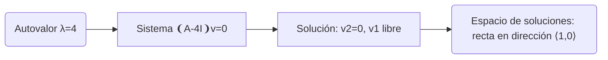

# Ejercicio de Multiplicidad
Con la matriz
```math
A = \begin{pmatrix}
4 & 1 \\
0 & 4
\end{pmatrix}
```
¿Cuál crees que es la multiplicidad algebraica y geométrica de su autovalor? 🤔

Usamos:
```math
p(\lambda) = \det(A - \lambda I)
```
```math
A_\lambda = A - \lambda I =
\begin{pmatrix}
4-\lambda & 1         \\
0         & 4-\lambda
\end{pmatrix}
```
Su determinante 

$$
\det(A_\lambda) = \det(A - \lambda I) = (4-\lambda)(4-\lambda) - (0)(1)
= (4-\lambda)^2
$$

Entonces el polinomio característico es:
```math
p(\lambda) = (4-\lambda)^2
```
Encuentra los autovalores

Buscamos las raíces de $p(\lambda) = 0$:
```math
(4-\lambda)^2 = 0
```

Resolvemos:
```math
4-\lambda = 0
\quad \Rightarrow \quad \lambda = 4
```

✅ Tenemos un único autovalor $\lambda = 4$

Además, su multiplicidad algebraica es $2$, porque el factor $(4-\lambda)$ está elevado al cuadrado.

### Resolver $(A-4I)\mathbf{v} = 0$

Ahora, buscamos los autovectores asociados a $\lambda = 4$.

Calculamos:

```math
A-4I =
\begin{pmatrix}
   4-4 & 1 \\
   0   & 4-4
   \end{pmatrix}
=
\begin{pmatrix}
   0 & 1 \\
   0 & 0
   \end{pmatrix}
```
Entonces el sistema $(A-4I)\mathbf{v} = 0$ es:
```math
\begin{pmatrix}
   0 & 1 \\
   0 & 0
   \end{pmatrix}
\begin{pmatrix}
   v_1 \\
   v_2
   \end{pmatrix}
= 
\begin{pmatrix}
   0 \\
   0
   \end{pmatrix}
```
Multiplicando:
```math
0 \cdot v_1 + 1 \cdot v_2 = 0
\quad \Rightarrow \quad
v_2 = 0
```
```math
0 = 0
\quad \text{(esta segunda fila ya siempre es verdadera)}
```

### 🎯 Paso 4: Describir el espacio nulo
- Sabemos que $v_2 = 0$,
- $v_1$ puede ser cualquier número real.

Entonces:
```math
\mathbf{v}
 =
 \begin{pmatrix}
  v_1 \\
  0
  \end{pmatrix}
 =
  v_1 \begin{pmatrix}
    1 \\
    0
    \end{pmatrix}
\quad \text{con} \quad
 v_1 \in \mathbb{R}
```

✅ Todos los autovectores son múltiplos del vector 

```math
\begin{pmatrix} 1 \\ 0 \end{pmatrix}
```

### ¿Cuál es la dimensión del espacio nulo?
🎯 Hay una variable libre $(v_1)$.

Así que:
- La dimensión del espacio nulo es 1.
- Multiplicidad geométrica = 1.

Resultado | Valor
--------- | -----
Autovalor | $\lambda = 4$
Multiplicidad algebraica | 2
Multiplicidad geométrica | 1
Autovectores | Todos los múltiplos de $(1 \\ 0 )$



