# Ejercicio de Multiplicidad
Con la matriz
```math
A = \begin{pmatrix}
4 & 1 \\
0 & 4
\end{pmatrix}
```
¿Cuál crees que es la multiplicidad algebraica y geométrica de su autovalor? 🤔

Usamos:
```math
p(\lambda) = \det(A - \lambda I)
```
```math
A_\lambda = A - \lambda I =
\begin{pmatrix}
4-\lambda & 1         \\
0         & 4-\lambda
\end{pmatrix}
```
Su determinante 

$$
\det(A_\lambda) = \det(A - \lambda I) = (4-\lambda)(4-\lambda) - (0)(1)
= (4-\lambda)^2
$$

Entonces el polinomio característico es:
```math
p(\lambda) = (4-\lambda)^2
```
Encuentra los autovalores

Buscamos las raíces de $p(\lambda) = 0$:
```math
(4-\lambda)^2 = 0
```

Resolvemos:
```math
4-\lambda = 0
\quad \Rightarrow \quad \lambda = 4
```

✅ Tenemos un único autovalor $\lambda = 4$

Además, su multiplicidad algebraica es $2$, porque el factor $(4-\lambda)$ está elevado al cuadrado.

### Resolver $(A-4I)\mathbf{v} = 0$

Ahora, buscamos los autovectores asociados a $\lambda = 4$.

Calculamos:

```math
A-4I =
\begin{pmatrix}
   4-4 & 1 \\
   0   & 4-4
   \end{pmatrix}
=
\begin{pmatrix}
   0 & 1 \\
   0 & 0
   \end{pmatrix}
```
Entonces el sistema $(A-4I)\mathbf{v} = 0$ es:
```math
\begin{pmatrix}
   0 & 1 \\
   0 & 0
   \end{pmatrix}
\begin{pmatrix}
   v_1 \\
   v_2
   \end{pmatrix}
= 
\begin{pmatrix}
   0 \\
   0
   \end{pmatrix}
```
Multiplicando:
```math
0 \cdot v_1 + 1 \cdot v_2 = 0
\quad \Rightarrow \quad
v_2 = 0
```
```math
0 = 0
\quad \text{(esta segunda fila ya siempre es verdadera)}
```

### 🎯 Paso 4: Describir el espacio nulo
- Sabemos que $v_2 = 0$,
- $v_1$ puede ser cualquier número real.

Entonces:
```math
\mathbf{v}
 =
 \begin{pmatrix}
  v_1 \\
  0
  \end{pmatrix}
 =
  v_1 \begin{pmatrix}
    1 \\
    0
    \end{pmatrix}
\quad \text{con} \quad
 v_1 \in \mathbb{R}
```

✅ Todos los autovectores son múltiplos del vector 

```math
\begin{pmatrix} 1 \\ 0 \end{pmatrix}
```

### ¿Cuál es la dimensión del espacio nulo?
🎯 Hay una variable libre $(v_1)$.

Así que:
- La dimensión del espacio nulo es 1.
- Multiplicidad geométrica = 1.

Resultado | Valor
--------- | -----
Autovalor | $\lambda = 4$
Multiplicidad algebraica | 2
Multiplicidad geométrica | 1
Autovectores | Todos los múltiplos de $(1 \\ 0 )$

```mermaid
graph LR
    Start(Autovalor λ=4)
    System[Sistema ❨A-4I❩v=0]
    Solve[Solución: v2=0, v1 libre]
    Space(Espacio de soluciones: recta en dirección ⟨1,0⟩)
    
    Start --> System --> Solve --> Space
```





![Uploading g<svg version="1.1" xmlns="http://www.w3.org/2000/svg" xmlns:xlink="http://www.w3.org/1999/xlink" width="961" height="839"><defs><clipPath id="pFopbhUcTrtU"><path fill="none" stroke="none" d=" M 0 0 L 961 0 L 961 839 L 0 839 L 0 0 Z"/></clipPath></defs><g transform="scale(1,1)" clip-path="url(#pFopbhUcTrtU)"><g><rect fill="rgb(255,255,255)" stroke="none" x="0" y="0" width="961" height="839" fill-opacity="1"/><path fill="none" stroke="rgb(192,192,192)" paint-order="fill stroke markers" d=" M 158.5 0.5 L 158.5 839.5 M 240.5 0.5 L 240.5 839.5 M 323.5 0.5 L 323.5 839.5 M 406.5 0.5 L 406.5 839.5 M 489.5 0.5 L 489.5 839.5 M 572.5 0.5 L 572.5 839.5 M 654.5 0.5 L 654.5 839.5 M 737.5 0.5 L 737.5 839.5 M 820.5 0.5 L 820.5 839.5 M 903.5 0.5 L 903.5 839.5" stroke-opacity="1" stroke-linecap="round" stroke-linejoin="round" stroke-miterlimit="10"/><path fill="none" stroke="rgb(192,192,192)" paint-order="fill stroke markers" d=" M 9.5 0.5 L 9.5 839.5 M 25.5 0.5 L 25.5 839.5 M 42.5 0.5 L 42.5 839.5 M 58.5 0.5 L 58.5 839.5 M 91.5 0.5 L 91.5 839.5 M 108.5 0.5 L 108.5 839.5 M 124.5 0.5 L 124.5 839.5 M 141.5 0.5 L 141.5 839.5 M 174.5 0.5 L 174.5 839.5 M 191.5 0.5 L 191.5 839.5 M 207.5 0.5 L 207.5 839.5 M 224.5 0.5 L 224.5 839.5 M 257.5 0.5 L 257.5 839.5 M 274.5 0.5 L 274.5 839.5 M 290.5 0.5 L 290.5 839.5 M 307.5 0.5 L 307.5 839.5 M 340.5 0.5 L 340.5 839.5 M 356.5 0.5 L 356.5 839.5 M 373.5 0.5 L 373.5 839.5 M 389.5 0.5 L 389.5 839.5 M 423.5 0.5 L 423.5 839.5 M 439.5 0.5 L 439.5 839.5 M 456.5 0.5 L 456.5 839.5 M 472.5 0.5 L 472.5 839.5 M 505.5 0.5 L 505.5 839.5 M 522.5 0.5 L 522.5 839.5 M 538.5 0.5 L 538.5 839.5 M 555.5 0.5 L 555.5 839.5 M 588.5 0.5 L 588.5 839.5 M 605.5 0.5 L 605.5 839.5 M 621.5 0.5 L 621.5 839.5 M 638.5 0.5 L 638.5 839.5 M 671.5 0.5 L 671.5 839.5 M 688.5 0.5 L 688.5 839.5 M 704.5 0.5 L 704.5 839.5 M 721.5 0.5 L 721.5 839.5 M 754.5 0.5 L 754.5 839.5 M 770.5 0.5 L 770.5 839.5 M 787.5 0.5 L 787.5 839.5 M 803.5 0.5 L 803.5 839.5 M 837.5 0.5 L 837.5 839.5 M 853.5 0.5 L 853.5 839.5 M 870.5 0.5 L 870.5 839.5 M 886.5 0.5 L 886.5 839.5 M 919.5 0.5 L 919.5 839.5 M 936.5 0.5 L 936.5 839.5 M 952.5 0.5 L 952.5 839.5" stroke-opacity="0.23529411764705882" stroke-linecap="round" stroke-linejoin="round" stroke-miterlimit="10"/><path fill="none" stroke="rgb(192,192,192)" paint-order="fill stroke markers" d=" M 0.5 56.5 L 961.5 56.5 M 0.5 56.5 L 961.5 56.5 M 0.5 139.5 L 961.5 139.5 M 0.5 222.5 L 961.5 222.5 M 0.5 305.5 L 961.5 305.5 M 0.5 388.5 L 961.5 388.5 M 0.5 553.5 L 961.5 553.5 M 0.5 636.5 L 961.5 636.5 M 0.5 719.5 L 961.5 719.5 M 0.5 802.5 L 961.5 802.5" stroke-opacity="1" stroke-linecap="round" stroke-linejoin="round" stroke-miterlimit="10"/><path fill="none" stroke="rgb(192,192,192)" paint-order="fill stroke markers" d=" M 0.5 7.5 L 961.5 7.5 M 0.5 7.5 L 961.5 7.5 M 0.5 23.5 L 961.5 23.5 M 0.5 40.5 L 961.5 40.5 M 0.5 73.5 L 961.5 73.5 M 0.5 89.5 L 961.5 89.5 M 0.5 106.5 L 961.5 106.5 M 0.5 123.5 L 961.5 123.5 M 0.5 156.5 L 961.5 156.5 M 0.5 172.5 L 961.5 172.5 M 0.5 189.5 L 961.5 189.5 M 0.5 205.5 L 961.5 205.5 M 0.5 239.5 L 961.5 239.5 M 0.5 255.5 L 961.5 255.5 M 0.5 272.5 L 961.5 272.5 M 0.5 288.5 L 961.5 288.5 M 0.5 321.5 L 961.5 321.5 M 0.5 338.5 L 961.5 338.5 M 0.5 354.5 L 961.5 354.5 M 0.5 371.5 L 961.5 371.5 M 0.5 404.5 L 961.5 404.5 M 0.5 421.5 L 961.5 421.5 M 0.5 437.5 L 961.5 437.5 M 0.5 454.5 L 961.5 454.5 M 0.5 487.5 L 961.5 487.5 M 0.5 503.5 L 961.5 503.5 M 0.5 520.5 L 961.5 520.5 M 0.5 537.5 L 961.5 537.5 M 0.5 570.5 L 961.5 570.5 M 0.5 586.5 L 961.5 586.5 M 0.5 603.5 L 961.5 603.5 M 0.5 619.5 L 961.5 619.5 M 0.5 653.5 L 961.5 653.5 M 0.5 669.5 L 961.5 669.5 M 0.5 686.5 L 961.5 686.5 M 0.5 702.5 L 961.5 702.5 M 0.5 735.5 L 961.5 735.5 M 0.5 752.5 L 961.5 752.5 M 0.5 768.5 L 961.5 768.5 M 0.5 785.5 L 961.5 785.5 M 0.5 818.5 L 961.5 818.5 M 0.5 835.5 L 961.5 835.5" stroke-opacity="0.23529411764705882" stroke-linecap="round" stroke-linejoin="round" stroke-miterlimit="10"/><path fill="none" stroke="rgb(37,37,37)" paint-order="fill stroke markers" d=" M 75.5 2.5 L 75.5 839.5" stroke-opacity="1" stroke-miterlimit="10"/><path fill="none" stroke="rgb(37,37,37)" paint-order="fill stroke markers" d=" M 75.5 1.5 L 71.5 5.5" stroke-opacity="1" stroke-miterlimit="10"/><path fill="none" stroke="rgb(37,37,37)" paint-order="fill stroke markers" d=" M 75.5 1.5 L 79.5 5.5" stroke-opacity="1" stroke-miterlimit="10"/><path fill="none" stroke="rgb(37,37,37)" paint-order="fill stroke markers" d=" M 0.5 470.5 L 959.5 470.5" stroke-opacity="1" stroke-miterlimit="10"/><path fill="none" stroke="rgb(37,37,37)" paint-order="fill stroke markers" d=" M 960.5 470.5 L 956.5 466.5" stroke-opacity="1" stroke-miterlimit="10"/><path fill="none" stroke="rgb(37,37,37)" paint-order="fill stroke markers" d=" M 960.5 470.5 L 956.5 474.5" stroke-opacity="1" stroke-miterlimit="10"/><text fill="rgb(37,37,37)" stroke="none" font-family="geogebra-sans-serif, sans-serif" font-size="12px" font-style="normal" font-weight="normal" text-decoration="normal" x="156" y="486" text-anchor="start" dominant-baseline="alphabetic" fill-opacity="1">2</text><text fill="rgb(37,37,37)" stroke="none" font-family="geogebra-sans-serif, sans-serif" font-size="12px" font-style="normal" font-weight="normal" text-decoration="normal" x="238" y="486" text-anchor="start" dominant-baseline="alphabetic" fill-opacity="1">4</text><text fill="rgb(37,37,37)" stroke="none" font-family="geogebra-sans-serif, sans-serif" font-size="12px" font-style="normal" font-weight="normal" text-decoration="normal" x="321" y="486" text-anchor="start" dominant-baseline="alphabetic" fill-opacity="1">6</text><text fill="rgb(37,37,37)" stroke="none" font-family="geogebra-sans-serif, sans-serif" font-size="12px" font-style="normal" font-weight="normal" text-decoration="normal" x="404" y="486" text-anchor="start" dominant-baseline="alphabetic" fill-opacity="1">8</text><text fill="rgb(37,37,37)" stroke="none" font-family="geogebra-sans-serif, sans-serif" font-size="12px" font-style="normal" font-weight="normal" text-decoration="normal" x="484" y="486" text-anchor="start" dominant-baseline="alphabetic" fill-opacity="1">10</text><text fill="rgb(37,37,37)" stroke="none" font-family="geogebra-sans-serif, sans-serif" font-size="12px" font-style="normal" font-weight="normal" text-decoration="normal" x="567" y="486" text-anchor="start" dominant-baseline="alphabetic" fill-opacity="1">12</text><text fill="rgb(37,37,37)" stroke="none" font-family="geogebra-sans-serif, sans-serif" font-size="12px" font-style="normal" font-weight="normal" text-decoration="normal" x="649" y="486" text-anchor="start" dominant-baseline="alphabetic" fill-opacity="1">14</text><text fill="rgb(37,37,37)" stroke="none" font-family="geogebra-sans-serif, sans-serif" font-size="12px" font-style="normal" font-weight="normal" text-decoration="normal" x="732" y="486" text-anchor="start" dominant-baseline="alphabetic" fill-opacity="1">16</text><text fill="rgb(37,37,37)" stroke="none" font-family="geogebra-sans-serif, sans-serif" font-size="12px" font-style="normal" font-weight="normal" text-decoration="normal" x="815" y="486" text-anchor="start" dominant-baseline="alphabetic" fill-opacity="1">18</text><text fill="rgb(37,37,37)" stroke="none" font-family="geogebra-sans-serif, sans-serif" font-size="12px" font-style="normal" font-weight="normal" text-decoration="normal" x="898" y="486" text-anchor="start" dominant-baseline="alphabetic" fill-opacity="1">20</text><text fill="rgb(37,37,37)" stroke="none" font-family="geogebra-sans-serif, sans-serif" font-size="12px" font-style="normal" font-weight="normal" text-decoration="normal" x="55" y="807" text-anchor="start" dominant-baseline="alphabetic" fill-opacity="1">–8</text><text fill="rgb(37,37,37)" stroke="none" font-family="geogebra-sans-serif, sans-serif" font-size="12px" font-style="normal" font-weight="normal" text-decoration="normal" x="55" y="724" text-anchor="start" dominant-baseline="alphabetic" fill-opacity="1">–6</text><text fill="rgb(37,37,37)" stroke="none" font-family="geogebra-sans-serif, sans-serif" font-size="12px" font-style="normal" font-weight="normal" text-decoration="normal" x="55" y="641" text-anchor="start" dominant-baseline="alphabetic" fill-opacity="1">–4</text><text fill="rgb(37,37,37)" stroke="none" font-family="geogebra-sans-serif, sans-serif" font-size="12px" font-style="normal" font-weight="normal" text-decoration="normal" x="55" y="558" text-anchor="start" dominant-baseline="alphabetic" fill-opacity="1">–2</text><text fill="rgb(37,37,37)" stroke="none" font-family="geogebra-sans-serif, sans-serif" font-size="12px" font-style="normal" font-weight="normal" text-decoration="normal" x="61" y="393" text-anchor="start" dominant-baseline="alphabetic" fill-opacity="1">2</text><text fill="rgb(37,37,37)" stroke="none" font-family="geogebra-sans-serif, sans-serif" font-size="12px" font-style="normal" font-weight="normal" text-decoration="normal" x="61" y="310" text-anchor="start" dominant-baseline="alphabetic" fill-opacity="1">4</text><text fill="rgb(37,37,37)" stroke="none" font-family="geogebra-sans-serif, sans-serif" font-size="12px" font-style="normal" font-weight="normal" text-decoration="normal" x="61" y="227" text-anchor="start" dominant-baseline="alphabetic" fill-opacity="1">6</text><text fill="rgb(37,37,37)" stroke="none" font-family="geogebra-sans-serif, sans-serif" font-size="12px" font-style="normal" font-weight="normal" text-decoration="normal" x="61" y="144" text-anchor="start" dominant-baseline="alphabetic" fill-opacity="1">8</text><text fill="rgb(37,37,37)" stroke="none" font-family="geogebra-sans-serif, sans-serif" font-size="12px" font-style="normal" font-weight="normal" text-decoration="normal" x="55" y="61" text-anchor="start" dominant-baseline="alphabetic" fill-opacity="1">10</text><text fill="rgb(37,37,37)" stroke="none" font-family="geogebra-sans-serif, sans-serif" font-size="12px" font-style="normal" font-weight="normal" text-decoration="normal" x="61" y="486" text-anchor="start" dominant-baseline="alphabetic" fill-opacity="1">0</text><path fill="none" stroke="rgb(255,0,0)" paint-order="fill stroke markers" d=" M -5 470.8549862489229 L 966 470.8549862489229" stroke-opacity="0.25098039215686274" stroke-linecap="round" stroke-linejoin="round" stroke-miterlimit="10" stroke-width="5"/><text fill="rgb(255,0,0)" stroke="none" font-family="geogebra-sans-serif, sans-serif" font-size="16px" font-style="normal" font-weight="normal" text-decoration="normal" x="24" y="462" text-anchor="start" dominant-baseline="alphabetic" fill-opacity="1"></text><path fill="rgb(0,255,0)" stroke="none" paint-order="stroke fill markers" d=" M 287.31299762854974 305.261390764879 C 287.31299762854974 308.022814514033 285.0744213777037 310.261390764879 282.31299762854974 310.261390764879 C 279.5515738793958 310.261390764879 277.31299762854974 308.022814514033 277.31299762854974 305.261390764879 C 277.31299762854974 302.4999670157251 279.5515738793958 300.261390764879 282.31299762854974 300.261390764879 C 285.0744213777037 300.261390764879 287.31299762854974 302.4999670157251 287.31299762854974 305.261390764879 Z" fill-opacity="1"/><path fill="none" stroke="rgb(0,0,0)" paint-order="fill stroke markers" d=" M 287.31299762854974 305.261390764879 C 287.31299762854974 308.022814514033 285.0744213777037 310.261390764879 282.31299762854974 310.261390764879 C 279.5515738793958 310.261390764879 277.31299762854974 308.022814514033 277.31299762854974 305.261390764879 C 277.31299762854974 302.4999670157251 279.5515738793958 300.261390764879 282.31299762854974 300.261390764879 C 285.0744213777037 300.261390764879 287.31299762854974 302.4999670157251 287.31299762854974 305.261390764879 Z" stroke-opacity="1" stroke-linecap="round" stroke-linejoin="round" stroke-miterlimit="10"/><text fill="rgb(0,255,0)" stroke="none" font-family="geogebra-sans-serif, sans-serif" font-size="16px" font-style="normal" font-weight="normal" text-decoration="normal" x="286" y="295" text-anchor="start" dominant-baseline="alphabetic" fill-opacity="1"></text><path fill="rgb(255,0,0)" stroke="none" paint-order="stroke fill markers" d=" M 99.7194021445072 466.6049862489229 L 99.7194021445072 469.6049862489229 L 75.32100327349656 469.6049862489229 C 74.63064733620807 469.6049862489229 74.07100327349656 470.1646303116344 74.07100327349656 470.8549862489229 C 74.07100327349656 471.54534218621137 74.63064733620807 472.1049862489229 75.32100327349656 472.1049862489229 L 99.7194021445072 472.1049862489229 L 99.7194021445072 475.1049862489229 L 116.7194021445072 470.8549862489229 L 99.7194021445072 466.6049862489229 Z" fill-opacity="0.6980392156862745"/><path fill="rgb(255,0,0)" stroke="none" paint-order="stroke fill markers" d=" M 245.91459875753912 470.8549862489229 C 245.91459875753912 473.61640999807685 243.6760225066931 475.8549862489229 240.91459875753912 475.8549862489229 C 238.15317500838515 475.8549862489229 235.91459875753912 473.61640999807685 235.91459875753912 470.8549862489229 C 235.91459875753912 468.09356249976895 238.15317500838515 465.8549862489229 240.91459875753912 465.8549862489229 C 243.6760225066931 465.8549862489229 245.91459875753912 468.09356249976895 245.91459875753912 470.8549862489229 Z" fill-opacity="1"/><path fill="none" stroke="rgb(0,0,0)" paint-order="fill stroke markers" d=" M 245.91459875753912 470.8549862489229 C 245.91459875753912 473.61640999807685 243.6760225066931 475.8549862489229 240.91459875753912 475.8549862489229 C 238.15317500838515 475.8549862489229 235.91459875753912 473.61640999807685 235.91459875753912 470.8549862489229 C 235.91459875753912 468.09356249976895 238.15317500838515 465.8549862489229 240.91459875753912 465.8549862489229 C 243.6760225066931 465.8549862489229 245.91459875753912 468.09356249976895 245.91459875753912 470.8549862489229 Z" stroke-opacity="1" stroke-linecap="round" stroke-linejoin="round" stroke-miterlimit="10"/><text fill="rgb(255,0,0)" stroke="none" font-family="geogebra-sans-serif, sans-serif" font-size="16px" font-style="normal" font-weight="normal" text-decoration="normal" x="245" y="461" text-anchor="start" dominant-baseline="alphabetic" fill-opacity="1"></text><path fill="rgb(255,127,0)" stroke="none" paint-order="stroke fill markers" d=" M 75.32100327349656 429.45658737791194 L 71.07100327349656 446.45658737791194 L 74.07100327349656 446.45658737791194 L 74.07100327349656 470.8549862489229 C 74.07100327349656 471.54534218621137 74.63064733620807 472.1049862489229 75.32100327349656 472.1049862489229 C 76.01135921078505 472.1049862489229 76.57100327349656 471.54534218621137 76.57100327349656 470.8549862489229 L 76.57100327349656 446.45658737791194 L 79.57100327349656 446.45658737791194 L 75.32100327349656 429.45658737791194 Z" fill-opacity="0.6980392156862745"/><path fill="rgb(255,127,0)" stroke="none" paint-order="stroke fill markers" d=" M 121.7194021445072 305.261390764879 C 121.7194021445072 308.022814514033 119.48082589366116 310.261390764879 116.7194021445072 310.261390764879 C 113.95797839535324 310.261390764879 111.7194021445072 308.022814514033 111.7194021445072 305.261390764879 C 111.7194021445072 302.4999670157251 113.95797839535324 300.261390764879 116.7194021445072 300.261390764879 C 119.48082589366116 300.261390764879 121.7194021445072 302.4999670157251 121.7194021445072 305.261390764879 Z" fill-opacity="1"/><path fill="none" stroke="rgb(0,0,0)" paint-order="fill stroke markers" d=" M 121.7194021445072 305.261390764879 C 121.7194021445072 308.022814514033 119.48082589366116 310.261390764879 116.7194021445072 310.261390764879 C 113.95797839535324 310.261390764879 111.7194021445072 308.022814514033 111.7194021445072 305.261390764879 C 111.7194021445072 302.4999670157251 113.95797839535324 300.261390764879 116.7194021445072 300.261390764879 C 119.48082589366116 300.261390764879 121.7194021445072 302.4999670157251 121.7194021445072 305.261390764879 Z" stroke-opacity="1" stroke-linecap="round" stroke-linejoin="round" stroke-miterlimit="10"/><text fill="rgb(255,127,0)" stroke="none" font-family="geogebra-sans-serif, sans-serif" font-size="16px" font-style="normal" font-weight="normal" text-decoration="normal" x="121" y="295" text-anchor="start" dominant-baseline="alphabetic" fill-opacity="1"></text><path fill="rgb(0,255,0)" stroke="none" paint-order="stroke fill markers" d=" M 116.7194021445072 429.45658737791194 L 101.6933830442931 438.47219883804047 L 103.81470338785277 440.59351918160013 L 103.81470338785275 440.59351918160013 L 74.43711979701337 469.97110277243974 C 73.94896443232429 470.4592581371288 73.9489644323243 471.250714360717 74.4371197970134 471.73886972540606 C 74.68119747935793 471.9829474077506 75.00110037642726 472.10498624892284 75.32100327349659 472.10498624892284 C 75.6409061705659 472.10498624892284 75.96080906763521 471.9829474077506 76.20488674997975 471.73886972540606 L 105.58247034081913 442.36128613456646 L 105.5824703408191 442.36128613456646 L 107.70379068437877 444.4826064781261 L 116.7194021445072 429.45658737791194 Z" fill-opacity="0.6980392156862745"/><path fill="none" stroke="rgb(255,127,0)" paint-order="fill stroke markers" d=" M -5 792.1389993429116 L 194.28474983572636 -5" stroke-opacity="0.25098039215686274" stroke-linecap="round" stroke-linejoin="round" stroke-miterlimit="10" stroke-width="5"/><path fill="none" stroke="rgb(0,0,0)" paint-order="fill stroke markers" d=" M -6.182094503805644 134.49299542195882 L -4.564969547906784 128.0244955983634 L -2.9478445920079395 121.5559957747679 L -1.3307196361090803 115.08749595117246 L 0.2864053197897647 108.61899612757696 L 1.9035302756886239 102.15049630398153 L 3.520655231587483 95.68199648038603 L 5.137780187486328 89.2134966567906 L 6.754905143385187 82.74499683319516 L 8.372030099284032 76.27649700959967 L 9.989155055182891 69.80799718600423 L 11.606280011081743 63.339497362408736 L 13.223404966980596 56.8709975388133 L 14.840529922879448 50.402497715217805 L 16.4576548787783 43.93399789162237 L 18.07477983467715 37.465498068026875 L 19.69190479057601 30.99699824443144 L 21.309029746474863 24.528498420835945 L 22.926154702373715 18.059998597240508 L 24.543279658272567 11.591498773645071 L 26.16040461417142 5.122998950049578 L 27.77752957007027 -1.3455008735458591 L 29.39465452596913 -7.814000697141353 M -5.535244521446103 794.279977428696 L -3.9181195655472436 787.8114776051005 L -2.3009946096483986 781.3429777815052 L -0.6838696537495395 774.8744779579097 L 0.9332553021493055 768.4059781343142 L 2.5503802580481647 761.9374783107187 L 4.167505213947024 755.4689784871232 L 5.784630169845869 749.0004786635278 L 7.401755125744728 742.5319788399323 L 9.018880081643573 736.0634790163369 L 10.636005037542432 729.5949791927414 L 12.253129993441284 723.126479369146 L 13.870254949340136 716.6579795455505 L 15.487379905238988 710.189479721955 L 17.10450486113784 703.7209798983596 L 18.7216298170367 697.2524800747641 L 20.338754772935552 690.7839802511686 L 21.955879728834404 684.3154804275732 L 23.573004684733256 677.8469806039777 L 25.190129640632108 671.3784807803822 L 26.80725459653096 664.9099809567867 L 28.424379552429812 658.4414811331914 L 30.04150450832867 651.9729813095959 L 31.658629464227523 645.5044814860004 L 33.275754420126376 639.035981662405 L 34.89287937602523 632.5674818388095 L 36.51000433192408 626.098982015214 L 38.12712928782293 619.6304821916185 L 39.74425424372179 613.161982368023 L 41.36137919962064 606.6934825444276 L 42.978504155519495 600.2249827208321 L 44.59562911141835 593.7564828972367 L 46.2127540673172 587.2879830736413 L 47.82987902321605 580.8194832500458 L 49.44700397911491 574.3509834264503 L 51.064128935013755 567.8824836028548 L 52.681253890912615 561.4139837792594 L 54.29837884681147 554.9454839556639 L 55.91550380271032 548.4769841320684 L 57.53262875860918 542.008484308473 L 59.14975371450802 535.5399844848776 L 60.76687867040688 529.071484661282 L 62.384003626305734 522.6029848376866 L 64.00112858220459 516.1344850140912 L 65.61825353810343 509.6659851904957 L 67.23537849400229 503.1974853669002 L 68.85250344990115 496.72898554330476 L 70.4696284058 490.26048571970927 L 72.08675336169885 483.79198589611383 L 73.7038783175977 477.32348607251834 L 75.32100327349656 470.8549862489229 L 76.93812822939542 464.38648642532746 L 78.55525318529426 457.91798660173197 L 80.17237814119312 451.44948677813653 L 81.78950309709197 444.98098695454104 L 83.40662805299083 438.5124871309456 L 85.02375300888968 432.0439873073501 L 86.64087796478853 425.57548748375467 L 88.25800292068739 419.1069876601592 L 89.87512787658623 412.63848783656374 L 91.4922528324851 406.16998801296825 L 93.10937778838394 399.7014881893728 L 94.7265027442828 393.2329883657774 L 96.34362770018166 386.7644885421819 L 97.9607526560805 380.2959887185864 L 99.57787761197936 373.82748889499095 L 101.1950025678782 367.3589890713955 L 102.81212752377706 360.8904892478 L 104.42925247967591 354.4219894242046 L 106.04637743557477 347.9534896006091 L 107.66350239147363 341.48498977701365 L 109.28062734737247 335.01648995341816 L 110.89775230327132 328.5479901298227 L 112.51487725917019 322.0794903062273 L 114.13200221506904 315.6109904826318 L 115.74912717096788 309.1424906590363 L 117.36625212686674 302.67399083544086 L 118.9833770827656 296.2054910118454 L 120.60050203866444 289.73699118824993 L 122.2176269945633 283.26849136465444 L 123.83475195046216 276.79999154105906 L 125.45187690636101 270.33149171746356 L 127.06900186225985 263.86299189386807 L 128.6861268181587 257.39449207027263 L 130.30325177405757 250.92599224667717 L 131.92037672995642 244.4574924230817 L 133.53750168585526 237.98899259948624 L 135.15462664175413 231.52049277589077 L 136.77175159765298 225.0519929522953 L 138.38887655355182 218.58349312869984 L 140.0060015094507 212.1149933051044 L 141.62312646534954 205.6464934815089 L 143.2402514212484 199.17799365791348 L 144.85737637714726 192.70949383431798 L 146.47450133304608 186.24099401072255 L 148.09162628894495 179.77249418712705 L 149.70875124484382 173.30399436353161 L 151.32587620074264 166.83549453993618 L 152.94300115664151 160.36699471634068 L 154.56012611254036 153.89849489274525 L 156.1772510684392 147.42999506914975 L 157.79437602433808 140.96149524555432 L 159.41150098023692 134.49299542195882 L 161.02862593613577 128.0244955983634 L 162.64575089203464 121.5559957747679 L 164.2628758479335 115.08749595117246 L 165.88000080383233 108.61899612757696 L 167.4971257597312 102.15049630398153 L 169.11425071563005 95.68199648038603 L 170.7313756715289 89.2134966567906 L 172.34850062742777 82.74499683319516 L 173.96562558332658 76.27649700959967 L 175.58275053922546 69.80799718600423 L 177.1998754951243 63.339497362408736 L 178.81700045102315 56.8709975388133 L 180.43412540692202 50.402497715217805 L 182.05125036282087 43.93399789162237 L 183.6683753187197 37.465498068026875 L 185.28550027461858 30.99699824443144 L 186.90262523051743 24.528498420835945 L 188.51975018641627 18.059998597240508 L 190.13687514231515 11.591498773645071 L 191.754000098214 5.122998950049578 L 193.37112505411284 -1.3455008735458591 L 194.9882500100117 -7.814000697141353 M 147.12135131540563 846.0279760174598 L 148.73847627130448 839.5594761938643 L 150.35560122720335 833.0909763702689 L 151.9727261831022 826.6224765466734 L 153.58985113900104 820.1539767230779 L 155.20697609489991 813.6854768994824 L 156.82410105079876 807.2169770758869 L 158.4412260066976 800.7484772522914 L 160.05835096259648 794.279977428696 L 161.67547591849532 787.8114776051005 L 163.29260087439417 781.3429777815052 L 164.90972583029304 774.8744779579097 L 166.52685078619186 768.4059781343142 L 168.14397574209073 761.9374783107187 L 169.7611006979896 755.4689784871232 L 171.37822565388842 749.0004786635278 L 172.9953506097873 742.5319788399323 L 174.61247556568614 736.0634790163369 L 176.22960052158498 729.5949791927414 L 177.84672547748386 723.126479369146 L 179.4638504333827 716.6579795455505 L 181.08097538928155 710.189479721955 L 182.69810034518042 703.7209798983596 L 184.31522530107927 697.2524800747641 L 185.9323502569781 690.7839802511686 L 187.54947521287698 684.3154804275732 L 189.16660016877583 677.8469806039777 L 190.78372512467467 671.3784807803822 L 192.40085008057355 664.9099809567867 L 194.01797503647236 658.4414811331914 L 195.63509999237124 651.9729813095959 L 197.25222494827008 645.5044814860004 L 198.86934990416893 639.035981662405 L 200.4864748600678 632.5674818388095 L 202.10359981596665 626.098982015214 L 203.7207247718655 619.6304821916185 L 205.33784972776436 613.161982368023 L 206.9549746836632 606.6934825444276 L 208.57209963956205 600.2249827208321 L 210.18922459546093 593.7564828972367 L 211.80634955135977 587.2879830736413 L 213.42347450725862 580.8194832500458 L 215.04059946315746 574.3509834264503 L 216.65772441905634 567.8824836028548 L 218.27484937495518 561.4139837792594 L 219.89197433085403 554.9454839556639 L 221.5090992867529 548.4769841320684 L 223.12622424265174 542.008484308473 L 224.7433491985506 535.5399844848776 L 226.36047415444943 529.071484661282 L 227.9775991103483 522.6029848376866 L 229.59472406624715 516.1344850140912 L 231.211849022146 509.6659851904957 L 232.82897397804487 503.1974853669002 L 234.44609893394372 496.72898554330476 L 236.06322388984256 490.26048571970927 L 237.6803488457414 483.79198589611383 L 239.29747380164028 477.32348607251834 L 240.91459875753912 470.8549862489229 L 242.53172371343797 464.38648642532746 L 244.14884866933684 457.91798660173197 L 245.7659736252357 451.44948677813653 L 247.38309858113453 444.98098695454104 L 249.00022353703338 438.5124871309456 L 250.61734849293225 432.0439873073501 L 252.2344734488311 425.57548748375467 L 253.85159840472994 419.1069876601592 L 255.46872336062881 412.63848783656374 L 257.08584831652763 406.16998801296825 L 258.7029732724265 399.7014881893728 L 260.3200982283254 393.2329883657774 L 261.9372231842242 386.7644885421819 L 263.55434814012307 380.2959887185864 L 265.17147309602194 373.82748889499095 L 266.78859805192076 367.3589890713955 L 268.40572300781963 360.8904892478 L 270.0228479637185 354.4219894242046 L 271.6399729196173 347.9534896006091 L 273.2570978755162 341.48498977701365 L 274.87422283141507 335.01648995341816 L 276.4913477873139 328.5479901298227 L 278.10847274321276 322.0794903062273 L 279.72559769911163 315.6109904826318 L 281.34272265501045 309.1424906590363 L 282.9598476109093 302.67399083544086 L 284.5769725668082 296.2054910118454 L 286.194097522707 289.73699118824993 L 287.8112224786058 283.26849136465444 L 289.42834743450476 276.79999154105906 L 291.0454723904036 270.33149171746356 L 292.6625973463024 263.86299189386807 L 294.2797223022013 257.39449207027263 L 295.89684725810014 250.92599224667717 L 297.51397221399895 244.4574924230817 L 299.1310971698978 237.98899259948624 L 300.7482221257967 231.52049277589077 L 302.3653470816955 225.0519929522953 L 303.9824720375944 218.58349312869984 L 305.59959699349326 212.1149933051044 L 307.2167219493921 205.6464934815089 L 308.83384690529095 199.17799365791348 L 310.4509718611898 192.70949383431798 L 312.06809681708864 186.24099401072255 L 313.6852217729875 179.77249418712705 L 315.3023467288864 173.30399436353161 L 316.9194716847852 166.83549453993618 L 318.5365966406841 160.36699471634068 L 320.15372159658295 153.89849489274525 L 321.77084655248177 147.42999506914975 L 323.38797150838064 140.96149524555432 L 325.0050964642795 134.49299542195882 L 326.62222142017833 128.0244955983634 L 328.2393463760772 121.5559957747679 L 329.8564713319761 115.08749595117246 L 331.4735962878749 108.61899612757696 L 333.09072124377377 102.15049630398153 L 334.7078461996726 95.68199648038603 L 336.32497115557146 89.2134966567906 L 337.94209611147033 82.74499683319516 L 339.55922106736915 76.27649700959967 L 341.176346023268 69.80799718600423 L 342.7934709791669 63.339497362408736 L 344.4105959350657 56.8709975388133 L 346.0277208909646 50.402497715217805 L 347.64484584686346 43.93399789162237 L 349.2619708027623 37.465498068026875 L 350.87909575866115 30.99699824443144 L 352.49622071455997 24.528498420835945 L 354.11334567045884 18.059998597240508 L 355.7304706263577 11.591498773645071 L 357.34759558225653 5.122998950049578 L 358.9647205381554 -1.3455008735458591 L 360.5818454940543 -7.814000697141353 M 312.71494679944817 846.0279760174598 L 314.3320717553471 839.5594761938643 L 315.9491967112459 833.0909763702689 L 317.56632166714473 826.6224765466734 L 319.1834466230436 820.1539767230779 L 320.8005715789425 813.6854768994824 L 322.4176965348413 807.2169770758869 L 324.03482149074017 800.7484772522914 L 325.65194644663904 794.279977428696 L 327.26907140253786 787.8114776051005 L 328.88619635843673 781.3429777815052 L 330.5033213143356 774.8744779579097 L 332.1204462702344 768.4059781343142 L 333.7375712261333 761.9374783107187 L 335.35469618203217 755.4689784871232 L 336.971821137931 749.0004786635278 L 338.58894609382986 742.5319788399323 L 340.20607104972873 736.0634790163369 L 341.82319600562755 729.5949791927414 L 343.4403209615264 723.126479369146 L 345.0574459174253 716.6579795455505 L 346.6745708733241 710.189479721955 L 348.291695829223 703.7209798983596 L 349.9088207851218 697.2524800747641 L 351.5259457410207 690.7839802511686 L 353.14307069691955 684.3154804275732 L 354.76019565281837 677.8469806039777 L 356.37732060871724 671.3784807803822 L 357.9944455646161 664.9099809567867 L 359.61157052051493 658.4414811331914 L 361.2286954764138 651.9729813095959 L 362.8458204323127 645.5044814860004 L 364.4629453882115 639.035981662405 L 366.08007034411037 632.5674818388095 L 367.69719530000924 626.098982015214 L 369.31432025590806 619.6304821916185 L 370.93144521180693 613.161982368023 L 372.54857016770575 606.6934825444276 L 374.1656951236046 600.2249827208321 L 375.7828200795035 593.7564828972367 L 377.3999450354023 587.2879830736413 L 379.0170699913012 580.8194832500458 L 380.63419494720006 574.3509834264503 L 382.2513199030989 567.8824836028548 L 383.86844485899775 561.4139837792594 L 385.4855698148966 554.9454839556639 L 387.10269477079544 548.4769841320684 L 388.7198197266943 542.008484308473 L 390.3369446825932 535.5399844848776 L 391.954069638492 529.071484661282 L 393.5711945943909 522.6029848376866 L 395.1883195502897 516.1344850140912 L 396.80544450618856 509.6659851904957 L 398.42256946208744 503.1974853669002 L 400.03969441798625 496.72898554330476 L 401.6568193738851 490.26048571970927 L 403.273944329784 483.79198589611383 L 404.8910692856828 477.32348607251834 L 406.5081942415817 470.8549862489229 L 408.12531919748056 464.38648642532746 L 409.7424441533794 457.91798660173197 L 411.35956910927825 451.44948677813653 L 412.9766940651771 444.98098695454104 L 414.59381902107594 438.5124871309456 L 416.2109439769748 432.0439873073501 L 417.8280689328737 425.57548748375467 L 419.4451938887725 419.1069876601592 L 421.0623188446714 412.63848783656374 L 422.6794438005702 406.16998801296825 L 424.29656875646907 399.7014881893728 L 425.91369371236794 393.2329883657774 L 427.53081866826676 386.7644885421819 L 429.14794362416563 380.2959887185864 L 430.7650685800645 373.82748889499095 L 432.3821935359633 367.3589890713955 L 433.9993184918622 360.8904892478 L 435.61644344776107 354.4219894242046 L 437.2335684036599 347.9534896006091 L 438.85069335955876 341.48498977701365 L 440.46781831545763 335.01648995341816 L 442.08494327135645 328.5479901298227 L 443.7020682272553 322.0794903062273 L 445.31919318315414 315.6109904826318 L 446.936318139053 309.1424906590363 L 448.5534430949519 302.67399083544086 L 450.1705680508507 296.2054910118454 L 451.7876930067496 289.73699118824993 L 453.40481796264845 283.26849136465444 L 455.02194291854727 276.79999154105906 L 456.63906787444614 270.33149171746356 L 458.256192830345 263.86299189386807 L 459.87331778624383 257.39449207027263 L 461.4904427421427 250.92599224667717 L 463.1075676980416 244.4574924230817 L 464.7246926539404 237.98899259948624 L 466.34181760983927 231.52049277589077 L 467.9589425657381 225.0519929522953 L 469.57606752163696 218.58349312869984 L 471.19319247753583 212.1149933051044 L 472.81031743343465 205.6464934815089 L 474.4274423893335 199.17799365791348 L 476.0445673452324 192.70949383431798 L 477.6616923011312 186.24099401072255 L 479.2788172570301 179.77249418712705 L 480.89594221292896 173.30399436353161 L 482.5130671688278 166.83549453993618 L 484.13019212472665 160.36699471634068 L 485.7473170806255 153.89849489274525 L 487.36444203652434 147.42999506914975 L 488.9815669924232 140.96149524555432 L 490.5986919483221 134.49299542195882 L 492.2158169042209 128.0244955983634 L 493.8329418601198 121.5559957747679 L 495.4500668160186 115.08749595117246 L 497.06719177191746 108.61899612757696 L 498.68431672781634 102.15049630398153 L 500.30144168371515 95.68199648038603 L 501.918566639614 89.2134966567906 L 503.5356915955129 82.74499683319516 L 505.1528165514117 76.27649700959967 L 506.7699415073106 69.80799718600423 L 508.38706646320946 63.339497362408736 L 510.0041914191083 56.8709975388133 L 511.62131637500715 50.402497715217805 L 513.238441330906 43.93399789162237 L 514.8555662868048 37.465498068026875 L 516.4726912427037 30.99699824443144 L 518.0898161986025 24.528498420835945 L 519.7069411545015 18.059998597240508 L 521.3240661104003 11.591498773645071 L 522.9411910662991 5.122998950049578 L 524.5583160221979 -1.3455008735458591 L 526.1754409780968 -7.814000697141353 M 478.3085422834908 846.0279760174598 L 479.9256672393896 839.5594761938643 L 481.5427921952885 833.0909763702689 L 483.15991715118736 826.6224765466734 L 484.7770421070862 820.1539767230779 L 486.39416706298505 813.6854768994824 L 488.01129201888386 807.2169770758869 L 489.62841697478274 800.7484772522914 L 491.2455419306816 794.279977428696 L 492.8626668865804 787.8114776051005 L 494.4797918424793 781.3429777815052 L 496.0969167983782 774.8744779579097 L 497.714041754277 768.4059781343142 L 499.33116671017586 761.9374783107187 L 500.94829166607474 755.4689784871232 L 502.56541662197355 749.0004786635278 L 504.1825415778724 742.5319788399323 L 505.7996665337713 736.0634790163369 L 507.4167914896701 729.5949791927414 L 509.033916445569 723.126479369146 L 510.65104140146786 716.6579795455505 L 512.2681663573667 710.189479721955 L 513.8852913132655 703.7209798983596 L 515.5024162691643 697.2524800747641 L 517.1195412250632 690.7839802511686 L 518.7366661809622 684.3154804275732 L 520.353791136861 677.8469806039777 L 521.9709160927598 671.3784807803822 L 523.5880410486586 664.9099809567867 L 525.2051660045574 658.4414811331914 L 526.8222909604564 651.9729813095959 L 528.4394159163553 645.5044814860004 L 530.0565408722541 639.035981662405 L 531.6736658281529 632.5674818388095 L 533.2907907840518 626.098982015214 L 534.9079157399506 619.6304821916185 L 536.5250406958495 613.161982368023 L 538.1421656517483 606.6934825444276 L 539.7592906076472 600.2249827208321 L 541.3764155635461 593.7564828972367 L 542.9935405194449 587.2879830736413 L 544.6106654753437 580.8194832500458 L 546.2277904312426 574.3509834264503 L 547.8449153871414 567.8824836028548 L 549.4620403430404 561.4139837792594 L 551.0791652989392 554.9454839556639 L 552.696290254838 548.4769841320684 L 554.3134152107368 542.008484308473 L 555.9305401666358 535.5399844848776 L 557.5476651225346 529.071484661282 L 559.1647900784335 522.6029848376866 L 560.7819150343323 516.1344850140912 L 562.3990399902311 509.6659851904957 L 564.01616494613 503.1974853669002 L 565.6332899020288 496.72898554330476 L 567.2504148579277 490.26048571970927 L 568.8675398138266 483.79198589611383 L 570.4846647697254 477.32348607251834 L 572.1017897256243 470.8549862489229 L 573.7189146815231 464.38648642532746 L 575.3360396374219 457.91798660173197 L 576.9531645933208 451.44948677813653 L 578.5702895492198 444.98098695454104 L 580.1874145051186 438.5124871309456 L 581.8045394610174 432.0439873073501 L 583.4216644169162 425.57548748375467 L 585.038789372815 419.1069876601592 L 586.655914328714 412.63848783656374 L 588.2730392846128 406.16998801296825 L 589.8901642405117 399.7014881893728 L 591.5072891964105 393.2329883657774 L 593.1244141523093 386.7644885421819 L 594.7415391082083 380.2959887185864 L 596.3586640641071 373.82748889499095 L 597.9757890200059 367.3589890713955 L 599.5929139759047 360.8904892478 L 601.2100389318036 354.4219894242046 L 602.8271638877025 347.9534896006091 L 604.4442888436013 341.48498977701365 L 606.0614137995002 335.01648995341816 L 607.678538755399 328.5479901298227 L 609.2956637112978 322.0794903062273 L 610.9127886671968 315.6109904826318 L 612.5299136230956 309.1424906590363 L 614.1470385789944 302.67399083544086 L 615.7641635348933 296.2054910118454 L 617.3812884907921 289.73699118824993 L 618.998413446691 283.26849136465444 L 620.6155384025899 276.79999154105906 L 622.2326633584887 270.33149171746356 L 623.8497883143875 263.86299189386807 L 625.4669132702865 257.39449207027263 L 627.0840382261853 250.92599224667717 L 628.7011631820841 244.4574924230817 L 630.318288137983 237.98899259948624 L 631.9354130938818 231.52049277589077 L 633.5525380497807 225.0519929522953 L 635.1696630056796 218.58349312869984 L 636.7867879615784 212.1149933051044 L 638.4039129174772 205.6464934815089 L 640.0210378733761 199.17799365791348 L 641.638162829275 192.70949383431798 L 643.2552877851738 186.24099401072255 L 644.8724127410727 179.77249418712705 L 646.4895376969715 173.30399436353161 L 648.1066626528703 166.83549453993618 L 649.7237876087692 160.36699471634068 L 651.3409125646681 153.89849489274525 L 652.9580375205669 147.42999506914975 L 654.5751624764657 140.96149524555432 L 656.1922874323647 134.49299542195882 L 657.8094123882635 128.0244955983634 L 659.4265373441623 121.5559957747679 L 661.0436623000612 115.08749595117246 L 662.66078725596 108.61899612757696 L 664.2779122118588 102.15049630398153 L 665.8950371677578 95.68199648038603 L 667.5121621236566 89.2134966567906 L 669.1292870795554 82.74499683319516 L 670.7464120354543 76.27649700959967 L 672.3635369913532 69.80799718600423 L 673.980661947252 63.339497362408736 L 675.5977869031509 56.8709975388133 L 677.2149118590497 50.402497715217805 L 678.8320368149485 43.93399789162237 L 680.4491617708475 37.465498068026875 L 682.0662867267463 30.99699824443144 L 683.6834116826451 24.528498420835945 L 685.300536638544 18.059998597240508 L 686.9176615944428 11.591498773645071 L 688.5347865503417 5.122998950049578 L 690.1519115062406 -1.3455008735458591 L 691.7690364621394 -7.814000697141353 M 643.9021377675333 846.0279760174598 L 645.5192627234322 839.5594761938643 L 647.136387679331 833.0909763702689 L 648.7535126352299 826.6224765466734 L 650.3706375911288 820.1539767230779 L 651.9877625470276 813.6854768994824 L 653.6048875029264 807.2169770758869 L 655.2220124588254 800.7484772522914 L 656.8391374147242 794.279977428696 L 658.456262370623 787.8114776051005 L 660.0733873265219 781.3429777815052 L 661.6905122824207 774.8744779579097 L 663.3076372383196 768.4059781343142 L 664.9247621942184 761.9374783107187 L 666.5418871501173 755.4689784871232 L 668.1590121060161 749.0004786635278 L 669.7761370619149 742.5319788399323 L 671.3932620178139 736.0634790163369 L 673.0103869737127 729.5949791927414 L 674.6275119296115 723.126479369146 L 676.2446368855104 716.6579795455505 L 677.8617618414092 710.189479721955 L 679.4788867973081 703.7209798983596 L 681.096011753207 697.2524800747641 L 682.7131367091058 690.7839802511686 L 684.3302616650046 684.3154804275732 L 685.9473866209036 677.8469806039777 L 687.5645115768024 671.3784807803822 L 689.1816365327012 664.9099809567867 L 690.7987614886001 658.4414811331914 L 692.4158864444989 651.9729813095959 L 694.0330114003978 645.5044814860004 L 695.6501363562967 639.035981662405 L 697.2672613121955 632.5674818388095 L 698.8843862680943 626.098982015214 L 700.5015112239932 619.6304821916185 L 702.1186361798921 613.161982368023 L 703.7357611357909 606.6934825444276 L 705.3528860916898 600.2249827208321 L 706.9700110475886 593.7564828972367 L 708.5871360034874 587.2879830736413 L 710.2042609593864 580.8194832500458 L 711.8213859152852 574.3509834264503 L 713.438510871184 567.8824836028548 L 715.0556358270828 561.4139837792594 L 716.6727607829818 554.9454839556639 L 718.2898857388806 548.4769841320684 L 719.9070106947794 542.008484308473 L 721.5241356506783 535.5399844848776 L 723.1412606065771 529.071484661282 L 724.758385562476 522.6029848376866 L 726.3755105183749 516.1344850140912 L 727.9926354742737 509.6659851904957 L 729.6097604301725 503.1974853669002 L 731.2268853860714 496.72898554330476 L 732.8440103419703 490.26048571970927 L 734.4611352978691 483.79198589611383 L 736.078260253768 477.32348607251834 L 737.6953852096668 470.8549862489229 L 739.3125101655656 464.38648642532746 L 740.9296351214646 457.91798660173197 L 742.5467600773634 451.44948677813653 L 744.1638850332622 444.98098695454104 L 745.7810099891611 438.5124871309456 L 747.39813494506 432.0439873073501 L 749.0152599009588 425.57548748375467 L 750.6323848568577 419.1069876601592 L 752.2495098127565 412.63848783656374 L 753.8666347686553 406.16998801296825 L 755.4837597245543 399.7014881893728 L 757.1008846804531 393.2329883657774 L 758.7180096363519 386.7644885421819 L 760.3351345922508 380.2959887185864 L 761.9522595481496 373.82748889499095 L 763.5693845040485 367.3589890713955 L 765.1865094599473 360.8904892478 L 766.8036344158462 354.4219894242046 L 768.420759371745 347.9534896006091 L 770.0378843276438 341.48498977701365 L 771.6550092835428 335.01648995341816 L 773.2721342394416 328.5479901298227 L 774.8892591953404 322.0794903062273 L 776.5063841512393 315.6109904826318 L 778.1235091071381 309.1424906590363 L 779.740634063037 302.67399083544086 L 781.3577590189359 296.2054910118454 L 782.9748839748347 289.73699118824993 L 784.5920089307335 283.26849136465444 L 786.2091338866325 276.79999154105906 L 787.8262588425313 270.33149171746356 L 789.4433837984301 263.86299189386807 L 791.060508754329 257.39449207027263 L 792.6776337102278 250.92599224667717 L 794.2947586661267 244.4574924230817 L 795.9118836220256 237.98899259948624 L 797.5290085779244 231.52049277589077 L 799.1461335338232 225.0519929522953 L 800.7632584897221 218.58349312869984 L 802.380383445621 212.1149933051044 L 803.9975084015198 205.6464934815089 L 805.6146333574187 199.17799365791348 L 807.2317583133175 192.70949383431798 L 808.8488832692163 186.24099401072255 L 810.4660082251153 179.77249418712705 L 812.0831331810141 173.30399436353161 L 813.7002581369129 166.83549453993618 L 815.3173830928117 160.36699471634068 L 816.9345080487107 153.89849489274525 L 818.5516330046095 147.42999506914975 L 820.1687579605083 140.96149524555432 L 821.7858829164072 134.49299542195882 L 823.403007872306 128.0244955983634 L 825.0201328282049 121.5559957747679 L 826.6372577841038 115.08749595117246 L 828.2543827400026 108.61899612757696 L 829.8715076959014 102.15049630398153 L 831.4886326518003 95.68199648038603 L 833.1057576076992 89.2134966567906 L 834.722882563598 82.74499683319516 L 836.3400075194969 76.27649700959967 L 837.9571324753957 69.80799718600423 L 839.5742574312945 63.339497362408736 L 841.1913823871935 56.8709975388133 L 842.8085073430923 50.402497715217805 L 844.4256322989911 43.93399789162237 L 846.04275725489 37.465498068026875 L 847.6598822107889 30.99699824443144 L 849.2770071666877 24.528498420835945 L 850.8941321225866 18.059998597240508 L 852.5112570784854 11.591498773645071 L 854.1283820343842 5.122998950049578 L 855.7455069902832 -1.3455008735458591 L 857.362631946182 -7.814000697141353 M 809.4957332515759 846.0279760174598 L 811.1128582074748 839.5594761938643 L 812.7299831633736 833.0909763702689 L 814.3471081192724 826.6224765466734 L 815.9642330751714 820.1539767230779 L 817.5813580310702 813.6854768994824 L 819.198482986969 807.2169770758869 L 820.8156079428679 800.7484772522914 L 822.4327328987667 794.279977428696 L 824.0498578546656 787.8114776051005 L 825.6669828105645 781.3429777815052 L 827.2841077664633 774.8744779579097 L 828.9012327223621 768.4059781343142 L 830.5183576782609 761.9374783107187 L 832.1354826341599 755.4689784871232 L 833.7526075900587 749.0004786635278 L 835.3697325459575 742.5319788399323 L 836.9868575018564 736.0634790163369 L 838.6039824577553 729.5949791927414 L 840.2211074136541 723.126479369146 L 841.838232369553 716.6579795455505 L 843.4553573254518 710.189479721955 L 845.0724822813506 703.7209798983596 L 846.6896072372496 697.2524800747641 L 848.3067321931484 690.7839802511686 L 849.9238571490472 684.3154804275732 L 851.5409821049461 677.8469806039777 L 853.1581070608449 671.3784807803822 L 854.7752320167438 664.9099809567867 L 856.3923569726427 658.4414811331914 L 858.0094819285415 651.9729813095959 L 859.6266068844403 645.5044814860004 L 861.2437318403393 639.035981662405 L 862.8608567962381 632.5674818388095 L 864.4779817521369 626.098982015214 L 866.0951067080358 619.6304821916185 L 867.7122316639346 613.161982368023 L 869.3293566198334 606.6934825444276 L 870.9464815757324 600.2249827208321 L 872.5636065316312 593.7564828972367 L 874.18073148753 587.2879830736413 L 875.7978564434289 580.8194832500458 L 877.4149813993278 574.3509834264503 L 879.0321063552266 567.8824836028548 L 880.6492313111254 561.4139837792594 L 882.2663562670243 554.9454839556639 L 883.8834812229231 548.4769841320684 L 885.500606178822 542.008484308473 L 887.1177311347209 535.5399844848776 L 888.7348560906197 529.071484661282 L 890.3519810465185 522.6029848376866 L 891.9691060024174 516.1344850140912 L 893.5862309583163 509.6659851904957 L 895.2033559142151 503.1974853669002 L 896.820480870114 496.72898554330476 L 898.4376058260128 490.26048571970927 L 900.0547307819116 483.79198589611383 L 901.6718557378106 477.32348607251834 L 903.2889806937094 470.8549862489229 L 904.9061056496082 464.38648642532746 L 906.5232306055071 457.91798660173197 L 908.140355561406 451.44948677813653 L 909.7574805173048 444.98098695454104 L 911.3746054732037 438.5124871309456 L 912.9917304291025 432.0439873073501 L 914.6088553850013 425.57548748375467 L 916.2259803409003 419.1069876601592 L 917.8431052967991 412.63848783656374 L 919.4602302526979 406.16998801296825 L 921.0773552085968 399.7014881893728 L 922.6944801644956 393.2329883657774 L 924.3116051203945 386.7644885421819 L 925.9287300762934 380.2959887185864 L 927.5458550321922 373.82748889499095 L 929.162979988091 367.3589890713955 L 930.7801049439898 360.8904892478 L 932.3972298998888 354.4219894242046 L 934.0143548557876 347.9534896006091 L 935.6314798116864 341.48498977701365 L 937.2486047675853 335.01648995341816 L 938.8657297234842 328.5479901298227 L 940.482854679383 322.0794903062273 L 942.0999796352819 315.6109904826318 L 943.7171045911807 309.1424906590363 L 945.3342295470795 302.67399083544086 L 946.9513545029785 296.2054910118454 L 948.5684794588773 289.73699118824993 L 950.1856044147761 283.26849136465444 L 951.802729370675 276.79999154105906 L 953.4198543265738 270.33149171746356 L 955.0369792824727 263.86299189386807 L 956.6541042383716 257.39449207027263 L 958.2712291942704 250.92599224667717 L 959.8883541501692 244.4574924230817 L 961.5054791060682 237.98899259948624 L 963.122604061967 231.52049277589077 L 964.7397290178658 225.0519929522953 L 966.3568539737647 218.58349312869984 M -7.475794468524725 802.0421772170106 L -1.007294644929317 802.0421772170106 L 5.4612051786661056 802.0421772170106 L 11.929705002261514 802.0421772170106 L 18.398204825856922 802.0421772170106 L 24.866704649452338 802.0421772170106 L 31.335204473047753 802.0421772170106 L 37.80370429664316 802.0421772170106 L 44.27220412023858 802.0421772170106 L 50.74070394383399 802.0421772170106 L 57.2092037674294 802.0421772170106 L 63.677703591024816 802.0421772170106 L 70.14620341462023 802.0421772170106 L 76.61470323821564 802.0421772170106 L 83.08320306181105 802.0421772170106 L 89.55170288540647 802.0421772170106 L 96.02020270900188 802.0421772170106 L 102.48870253259729 802.0421772170106 L 108.95720235619271 802.0421772170106 L 115.42570217978812 802.0421772170106 L 121.89420200338353 802.0421772170106 L 128.36270182697893 802.0421772170106 L 134.83120165057437 802.0421772170106 L 141.29970147416975 802.0421772170106 L 147.7682012977652 802.0421772170106 L 154.2367011213606 802.0421772170106 L 160.705200944956 802.0421772170106 L 167.1737007685514 802.0421772170106 L 173.64220059214682 802.0421772170106 L 180.11070041574226 802.0421772170106 L 186.57920023933764 802.0421772170106 L 193.04770006293307 802.0421772170106 L 199.51619988652848 802.0421772170106 L 205.9846997101239 802.0421772170106 L 212.4531995337193 802.0421772170106 L 218.9216993573147 802.0421772170106 L 225.39019918091014 802.0421772170106 L 231.85869900450555 802.0421772170106 L 238.32719882810096 802.0421772170106 L 244.79569865169637 802.0421772170106 L 251.26419847529178 802.0421772170106 L 257.73269829888716 802.0421772170106 L 264.20119812248265 802.0421772170106 L 270.66969794607803 802.0421772170106 L 277.1381977696734 802.0421772170106 L 283.60669759326885 802.0421772170106 L 290.0751974168643 802.0421772170106 L 296.54369724045966 802.0421772170106 L 303.0121970640551 802.0421772170106 L 309.48069688765054 802.0421772170106 L 315.9491967112459 802.0421772170106 L 322.4176965348413 802.0421772170106 L 328.88619635843673 802.0421772170106 L 335.35469618203217 802.0421772170106 L 341.82319600562755 802.0421772170106 L 348.291695829223 802.0421772170106 L 354.76019565281837 802.0421772170106 L 361.2286954764138 802.0421772170106 L 367.69719530000924 802.0421772170106 L 374.1656951236046 802.0421772170106 L 380.63419494720006 802.0421772170106 L 387.10269477079544 802.0421772170106 L 393.5711945943909 802.0421772170106 L 400.03969441798625 802.0421772170106 L 406.5081942415817 802.0421772170106 L 412.9766940651771 802.0421772170106 L 419.4451938887725 802.0421772170106 L 425.91369371236794 802.0421772170106 L 432.3821935359633 802.0421772170106 L 438.85069335955876 802.0421772170106 L 445.31919318315414 802.0421772170106 L 451.7876930067496 802.0421772170106 L 458.256192830345 802.0421772170106 L 464.7246926539404 802.0421772170106 L 471.19319247753583 802.0421772170106 L 477.6616923011312 802.0421772170106 L 484.13019212472665 802.0421772170106 L 490.5986919483221 802.0421772170106 L 497.06719177191746 802.0421772170106 L 503.5356915955129 802.0421772170106 L 510.0041914191083 802.0421772170106 L 516.4726912427037 802.0421772170106 L 522.9411910662991 802.0421772170106 L 529.4096908898946 802.0421772170106 L 535.87819071349 802.0421772170106 L 542.3466905370854 802.0421772170106 L 548.8151903606808 802.0421772170106 L 555.2836901842761 802.0421772170106 L 561.7521900078716 802.0421772170106 L 568.220689831467 802.0421772170106 L 574.6891896550624 802.0421772170106 L 581.1576894786579 802.0421772170106 L 587.6261893022532 802.0421772170106 L 594.0946891258486 802.0421772170106 L 600.5631889494441 802.0421772170106 L 607.0316887730395 802.0421772170106 L 613.5001885966349 802.0421772170106 L 619.9686884202304 802.0421772170106 L 626.4371882438257 802.0421772170106 L 632.9056880674211 802.0421772170106 L 639.3741878910165 802.0421772170106 L 645.842687714612 802.0421772170106 L 652.3111875382074 802.0421772170106 L 658.7796873618028 802.0421772170106 L 665.2481871853983 802.0421772170106 L 671.7166870089936 802.0421772170106 L 678.185186832589 802.0421772170106 L 684.6536866561844 802.0421772170106 L 691.1221864797799 802.0421772170106 L 697.5906863033753 802.0421772170106 L 704.0591861269706 802.0421772170106 L 710.5276859505661 802.0421772170106 L 716.9961857741615 802.0421772170106 L 723.4646855977569 802.0421772170106 L 729.9331854213523 802.0421772170106 L 736.4016852449478 802.0421772170106 L 742.8701850685432 802.0421772170106 L 749.3386848921385 802.0421772170106 L 755.807184715734 802.0421772170106 L 762.2756845393294 802.0421772170106 L 768.7441843629248 802.0421772170106 L 775.2126841865202 802.0421772170106 L 781.6811840101157 802.0421772170106 L 788.149683833711 802.0421772170106 L 794.6181836573064 802.0421772170106 L 801.0866834809019 802.0421772170106 L 807.5551833044973 802.0421772170106 L 814.0236831280927 802.0421772170106 L 820.492182951688 802.0421772170106 L 826.9606827752835 802.0421772170106 L 833.4291825988789 802.0421772170106 L 839.8976824224743 802.0421772170106 L 846.3661822460698 802.0421772170106 L 852.8346820696652 802.0421772170106 L 859.3031818932606 802.0421772170106 L 865.771681716856 802.0421772170106 L 872.2401815404514 802.0421772170106 L 878.7086813640468 802.0421772170106 L 885.1771811876422 802.0421772170106 L 891.6456810112377 802.0421772170106 L 898.1141808348331 802.0421772170106 L 904.5826806584284 802.0421772170106 L 911.0511804820239 802.0421772170106 L 917.5196803056193 802.0421772170106 L 923.9881801292147 802.0421772170106 L 930.4566799528101 802.0421772170106 L 936.9251797764056 802.0421772170106 L 943.393679600001 802.0421772170106 L 949.8621794235963 802.0421772170106 L 956.3306792471918 802.0421772170106 L 962.7991790707872 802.0421772170106 L 969.2676788943826 802.0421772170106 M -11.35689436268197 636.4485817329668 L -4.888394539086562 636.4485817329668 L 1.5801052845088464 636.4485817329668 L 8.048605108104269 636.4485817329668 L 14.517104931699677 636.4485817329668 L 20.985604755295093 636.4485817329668 L 27.4541045788905 636.4485817329668 L 33.922604402485916 636.4485817329668 L 40.39110422608133 636.4485817329668 L 46.85960404967674 636.4485817329668 L 53.328103873272156 636.4485817329668 L 59.796603696867564 636.4485817329668 L 66.26510352046299 636.4485817329668 L 72.7336033440584 636.4485817329668 L 79.2021031676538 636.4485817329668 L 85.67060299124921 636.4485817329668 L 92.13910281484463 636.4485817329668 L 98.60760263844004 636.4485817329668 L 105.07610246203546 636.4485817329668 L 111.54460228563087 636.4485817329668 L 118.01310210922628 636.4485817329668 L 124.48160193282169 636.4485817329668 L 130.9501017564171 636.4485817329668 L 137.41860158001253 636.4485817329668 L 143.88710140360791 636.4485817329668 L 150.35560122720335 636.4485817329668 L 156.82410105079876 636.4485817329668 L 163.29260087439417 636.4485817329668 L 169.7611006979896 636.4485817329668 L 176.22960052158498 636.4485817329668 L 182.69810034518042 636.4485817329668 L 189.16660016877583 636.4485817329668 L 195.63509999237124 636.4485817329668 L 202.10359981596665 636.4485817329668 L 208.57209963956205 636.4485817329668 L 215.04059946315746 636.4485817329668 L 221.5090992867529 636.4485817329668 L 227.9775991103483 636.4485817329668 L 234.44609893394372 636.4485817329668 L 240.91459875753912 636.4485817329668 L 247.38309858113453 636.4485817329668 L 253.85159840472994 636.4485817329668 L 260.3200982283254 636.4485817329668 L 266.78859805192076 636.4485817329668 L 273.2570978755162 636.4485817329668 L 279.72559769911163 636.4485817329668 L 286.194097522707 636.4485817329668 L 292.6625973463024 636.4485817329668 L 299.1310971698978 636.4485817329668 L 305.59959699349326 636.4485817329668 L 312.06809681708864 636.4485817329668 L 318.5365966406841 636.4485817329668 L 325.0050964642795 636.4485817329668 L 331.4735962878749 636.4485817329668 L 337.94209611147033 636.4485817329668 L 344.4105959350657 636.4485817329668 L 350.87909575866115 636.4485817329668 L 357.34759558225653 636.4485817329668 L 363.81609540585197 636.4485817329668 L 370.2845952294474 636.4485817329668 L 376.7530950530428 636.4485817329668 L 383.2215948766382 636.4485817329668 L 389.6900947002336 636.4485817329668 L 396.15859452382904 636.4485817329668 L 402.6270943474244 636.4485817329668 L 409.09559417101985 636.4485817329668 L 415.5640939946153 636.4485817329668 L 422.03259381821067 636.4485817329668 L 428.5010936418061 636.4485817329668 L 434.9695934654015 636.4485817329668 L 441.4380932889969 636.4485817329668 L 447.9065931125923 636.4485817329668 L 454.37509293618774 636.4485817329668 L 460.8435927597832 636.4485817329668 L 467.31209258337856 636.4485817329668 L 473.780592406974 636.4485817329668 L 480.2490922305694 636.4485817329668 L 486.7175920541648 636.4485817329668 L 493.18609187776025 636.4485817329668 L 499.6545917013556 636.4485817329668 L 506.12309152495106 636.4485817329668 L 512.5915913485464 636.4485817329668 L 519.0600911721419 636.4485817329668 L 525.5285909957372 636.4485817329668 L 531.9970908193327 636.4485817329668 L 538.4655906429282 636.4485817329668 L 544.9340904665235 636.4485817329668 L 551.402590290119 636.4485817329668 L 557.8710901137143 636.4485817329668 L 564.3395899373097 636.4485817329668 L 570.8080897609052 636.4485817329668 L 577.2765895845006 636.4485817329668 L 583.745089408096 636.4485817329668 L 590.2135892316915 636.4485817329668 L 596.6820890552868 636.4485817329668 L 603.1505888788822 636.4485817329668 L 609.6190887024776 636.4485817329668 L 616.0875885260731 636.4485817329668 L 622.5560883496685 636.4485817329668 L 629.0245881732639 636.4485817329668 L 635.4930879968593 636.4485817329668 L 641.9615878204547 636.4485817329668 L 648.4300876440501 636.4485817329668 L 654.8985874676456 636.4485817329668 L 661.367087291241 636.4485817329668 L 667.8355871148364 636.4485817329668 L 674.3040869384317 636.4485817329668 L 680.7725867620272 636.4485817329668 L 687.2410865856226 636.4485817329668 L 693.709586409218 636.4485817329668 L 700.1780862328135 636.4485817329668 L 706.6465860564089 636.4485817329668 L 713.1150858800042 636.4485817329668 L 719.5835857035996 636.4485817329668 L 726.0520855271951 636.4485817329668 L 732.5205853507905 636.4485817329668 L 738.9890851743859 636.4485817329668 L 745.4575849979814 636.4485817329668 L 751.9260848215768 636.4485817329668 L 758.3945846451721 636.4485817329668 L 764.8630844687675 636.4485817329668 L 771.331584292363 636.4485817329668 L 777.8000841159584 636.4485817329668 L 784.2685839395538 636.4485817329668 L 790.7370837631493 636.4485817329668 L 797.2055835867446 636.4485817329668 L 803.67408341034 636.4485817329668 L 810.1425832339354 636.4485817329668 L 816.6110830575309 636.4485817329668 L 823.0795828811263 636.4485817329668 L 829.5480827047217 636.4485817329668 L 836.0165825283171 636.4485817329668 L 842.4850823519125 636.4485817329668 L 848.9535821755079 636.4485817329668 L 855.4220819991033 636.4485817329668 L 861.8905818226988 636.4485817329668 L 868.3590816462942 636.4485817329668 L 874.8275814698895 636.4485817329668 L 881.296081293485 636.4485817329668 L 887.7645811170804 636.4485817329668 L 894.2330809406758 636.4485817329668 L 900.7015807642712 636.4485817329668 L 907.1700805878667 636.4485817329668 L 913.638580411462 636.4485817329668 L 920.1070802350574 636.4485817329668 L 926.5755800586529 636.4485817329668 L 933.0440798822483 636.4485817329668 L 939.5125797058437 636.4485817329668 L 945.9810795294392 636.4485817329668 L 952.4495793530346 636.4485817329668 L 958.9180791766299 636.4485817329668 L 965.3865790002253 636.4485817329668 L 971.8550788238208 636.4485817329668 M -8.769494433243807 470.8549862489229 L -2.3009946096483986 470.8549862489229 L 4.167505213947024 470.8549862489229 L 10.636005037542432 470.8549862489229 L 17.10450486113784 470.8549862489229 L 23.573004684733256 470.8549862489229 L 30.04150450832867 470.8549862489229 L 36.51000433192408 470.8549862489229 L 42.978504155519495 470.8549862489229 L 49.44700397911491 470.8549862489229 L 55.91550380271032 470.8549862489229 L 62.384003626305734 470.8549862489229 L 68.85250344990115 470.8549862489229 L 75.32100327349656 470.8549862489229 L 81.78950309709197 470.8549862489229 L 88.25800292068739 470.8549862489229 L 94.7265027442828 470.8549862489229 L 101.1950025678782 470.8549862489229 L 107.66350239147363 470.8549862489229 L 114.13200221506904 470.8549862489229 L 120.60050203866444 470.8549862489229 L 127.06900186225985 470.8549862489229 L 133.53750168585526 470.8549862489229 L 140.0060015094507 470.8549862489229 L 146.47450133304608 470.8549862489229 L 152.94300115664151 470.8549862489229 L 159.41150098023692 470.8549862489229 L 165.88000080383233 470.8549862489229 L 172.34850062742777 470.8549862489229 L 178.81700045102315 470.8549862489229 L 185.28550027461858 470.8549862489229 L 191.754000098214 470.8549862489229 L 198.2224999218094 470.8549862489229 L 204.6909997454048 470.8549862489229 L 211.15949956900022 470.8549862489229 L 217.62799939259563 470.8549862489229 L 224.09649921619106 470.8549862489229 L 230.56499903978647 470.8549862489229 L 237.03349886338188 470.8549862489229 L 243.5019986869773 470.8549862489229 L 249.9704985105727 470.8549862489229 L 256.4389983341681 470.8549862489229 L 262.90749815776354 470.8549862489229 L 269.375997981359 470.8549862489229 L 275.84449780495436 470.8549862489229 L 282.31299762854974 470.8549862489229 L 288.7814974521452 470.8549862489229 L 295.2499972757406 470.8549862489229 L 301.718497099336 470.8549862489229 L 308.1869969229314 470.8549862489229 L 314.65549674652686 470.8549862489229 L 321.12399657012224 470.8549862489229 L 327.5924963937176 470.8549862489229 L 334.06099621731306 470.8549862489229 L 340.5294960409085 470.8549862489229 L 346.9979958645039 470.8549862489229 L 353.4664956880993 470.8549862489229 L 359.9349955116947 470.8549862489229 L 366.40349533529013 470.8549862489229 L 372.87199515888557 470.8549862489229 L 379.34049498248095 470.8549862489229 L 385.8089948060764 470.8549862489229 L 392.27749462967176 470.8549862489229 L 398.7459944532672 470.8549862489229 L 405.2144942768626 470.8549862489229 L 411.682994100458 470.8549862489229 L 418.15149392405345 470.8549862489229 L 424.61999374764883 470.8549862489229 L 431.08849357124427 470.8549862489229 L 437.55699339483965 470.8549862489229 L 444.0254932184351 470.8549862489229 L 450.4939930420305 470.8549862489229 L 456.9624928656259 470.8549862489229 L 463.43099268922134 470.8549862489229 L 469.8994925128167 470.8549862489229 L 476.36799233641216 470.8549862489229 L 482.83649216000754 470.8549862489229 L 489.304991983603 470.8549862489229 L 495.7734918071984 470.8549862489229 L 502.2419916307938 470.8549862489229 L 508.7104914543892 470.8549862489229 L 515.1789912779846 470.8549862489229 L 521.64749110158 470.8549862489229 L 528.1159909251754 470.8549862489229 L 534.5844907487708 470.8549862489229 L 541.0529905723663 470.8549862489229 L 547.5214903959617 470.8549862489229 L 553.9899902195571 470.8549862489229 L 560.4584900431526 470.8549862489229 L 566.9269898667479 470.8549862489229 L 573.3954896903433 470.8549862489229 L 579.8639895139388 470.8549862489229 L 586.3324893375342 470.8549862489229 L 592.8009891611296 470.8549862489229 L 599.269488984725 470.8549862489229 L 605.7379888083204 470.8549862489229 L 612.2064886319158 470.8549862489229 L 618.6749884555112 470.8549862489229 L 625.1434882791067 470.8549862489229 L 631.6119881027021 470.8549862489229 L 638.0804879262975 470.8549862489229 L 644.5489877498928 470.8549862489229 L 651.0174875734883 470.8549862489229 L 657.4859873970837 470.8549862489229 L 663.9544872206791 470.8549862489229 L 670.4229870442746 470.8549862489229 L 676.89148686787 470.8549862489229 L 683.3599866914653 470.8549862489229 L 689.8284865150607 470.8549862489229 L 696.2969863386562 470.8549862489229 L 702.7654861622516 470.8549862489229 L 709.233985985847 470.8549862489229 L 715.7024858094425 470.8549862489229 L 722.1709856330378 470.8549862489229 L 728.6394854566332 470.8549862489229 L 735.1079852802286 470.8549862489229 L 741.5764851038241 470.8549862489229 L 748.0449849274195 470.8549862489229 L 754.5134847510149 470.8549862489229 L 760.9819845746104 470.8549862489229 L 767.4504843982057 470.8549862489229 L 773.9189842218011 470.8549862489229 L 780.3874840453966 470.8549862489229 L 786.855983868992 470.8549862489229 L 793.3244836925874 470.8549862489229 L 799.7929835161827 470.8549862489229 L 806.2614833397782 470.8549862489229 L 812.7299831633736 470.8549862489229 L 819.198482986969 470.8549862489229 L 825.6669828105645 470.8549862489229 L 832.1354826341599 470.8549862489229 L 838.6039824577553 470.8549862489229 L 845.0724822813506 470.8549862489229 L 851.5409821049461 470.8549862489229 L 858.0094819285415 470.8549862489229 L 864.4779817521369 470.8549862489229 L 870.9464815757324 470.8549862489229 L 877.4149813993278 470.8549862489229 L 883.8834812229231 470.8549862489229 L 890.3519810465185 470.8549862489229 L 896.820480870114 470.8549862489229 L 903.2889806937094 470.8549862489229 L 909.7574805173048 470.8549862489229 L 916.2259803409003 470.8549862489229 L 922.6944801644956 470.8549862489229 L 929.162979988091 470.8549862489229 L 935.6314798116864 470.8549862489229 L 942.0999796352819 470.8549862489229 L 948.5684794588773 470.8549862489229 L 955.0369792824727 470.8549862489229 L 961.5054791060682 470.8549862489229 L 967.9739789296635 470.8549862489229 M -6.182094503805644 305.261390764879 L 0.2864053197897647 305.261390764879 L 6.754905143385187 305.261390764879 L 13.223404966980596 305.261390764879 L 19.69190479057601 305.261390764879 L 26.16040461417142 305.261390764879 L 32.628904437766835 305.261390764879 L 39.09740426136224 305.261390764879 L 45.56590408495766 305.261390764879 L 52.034403908553074 305.261390764879 L 58.50290373214848 305.261390764879 L 64.9714035557439 305.261390764879 L 71.43990337933931 305.261390764879 L 77.90840320293472 305.261390764879 L 84.37690302653013 305.261390764879 L 90.84540285012555 305.261390764879 L 97.31390267372096 305.261390764879 L 103.78240249731638 305.261390764879 L 110.25090232091179 305.261390764879 L 116.7194021445072 305.261390764879 L 123.18790196810261 305.261390764879 L 129.65640179169802 305.261390764879 L 136.12490161529342 305.261390764879 L 142.59340143888886 305.261390764879 L 149.06190126248427 305.261390764879 L 155.53040108607968 305.261390764879 L 161.9989009096751 305.261390764879 L 168.4674007332705 305.261390764879 L 174.93590055686593 305.261390764879 L 181.4044003804613 305.261390764879 L 187.87290020405675 305.261390764879 L 194.34140002765216 305.261390764879 L 200.80989985124756 305.261390764879 L 207.27839967484297 305.261390764879 L 213.74689949843838 305.261390764879 L 220.21539932203382 305.261390764879 L 226.68389914562923 305.261390764879 L 233.15239896922463 305.261390764879 L 239.62089879282004 305.261390764879 L 246.08939861641545 305.261390764879 L 252.55789844001086 305.261390764879 L 259.02639826360627 305.261390764879 L 265.4948980872017 305.261390764879 L 271.9633979107971 305.261390764879 L 278.4318977343925 305.261390764879 L 284.90039755798796 305.261390764879 L 291.36889738158334 305.261390764879 L 297.8373972051787 305.261390764879 L 304.3058970287742 305.261390764879 L 310.7743968523696 305.261390764879 L 317.24289667596497 305.261390764879 L 323.7113964995604 305.261390764879 L 330.17989632315584 305.261390764879 L 336.6483961467512 305.261390764879 L 343.11689597034666 305.261390764879 L 349.58539579394204 305.261390764879 L 356.0538956175375 305.261390764879 L 362.52239544113286 305.261390764879 L 368.9908952647283 305.261390764879 L 375.45939508832373 305.261390764879 L 381.9278949119191 305.261390764879 L 388.39639473551455 305.261390764879 L 394.8648945591099 305.261390764879 L 401.33339438270536 305.261390764879 L 407.8018942063008 305.261390764879 L 414.2703940298962 305.261390764879 L 420.7388938534916 305.261390764879 L 427.207393677087 305.261390764879 L 433.67589350068243 305.261390764879 L 440.1443933242778 305.261390764879 L 446.61289314787325 305.261390764879 L 453.0813929714687 305.261390764879 L 459.54989279506407 305.261390764879 L 466.0183926186595 305.261390764879 L 472.4868924422549 305.261390764879 L 478.9553922658503 305.261390764879 L 485.4238920894457 305.261390764879 L 491.89239191304114 305.261390764879 L 498.3608917366366 305.261390764879 L 504.82939156023195 305.261390764879 L 511.2978913838274 305.261390764879 L 517.7663912074228 305.261390764879 L 524.2348910310182 305.261390764879 L 530.7033908546136 305.261390764879 L 537.171890678209 305.261390764879 L 543.6403905018044 305.261390764879 L 550.1088903253999 305.261390764879 L 556.5773901489953 305.261390764879 L 563.0458899725907 305.261390764879 L 569.5143897961862 305.261390764879 L 575.9828896197815 305.261390764879 L 582.4513894433769 305.261390764879 L 588.9198892669723 305.261390764879 L 595.3883890905678 305.261390764879 L 601.8568889141632 305.261390764879 L 608.3253887377585 305.261390764879 L 614.793888561354 305.261390764879 L 621.2623883849494 305.261390764879 L 627.7308882085448 305.261390764879 L 634.1993880321402 305.261390764879 L 640.6678878557357 305.261390764879 L 647.136387679331 305.261390764879 L 653.6048875029264 305.261390764879 L 660.0733873265219 305.261390764879 L 666.5418871501173 305.261390764879 L 673.0103869737127 305.261390764879 L 679.4788867973081 305.261390764879 L 685.9473866209036 305.261390764879 L 692.4158864444989 305.261390764879 L 698.8843862680943 305.261390764879 L 705.3528860916898 305.261390764879 L 711.8213859152852 305.261390764879 L 718.2898857388806 305.261390764879 L 724.758385562476 305.261390764879 L 731.2268853860714 305.261390764879 L 737.6953852096668 305.261390764879 L 744.1638850332622 305.261390764879 L 750.6323848568577 305.261390764879 L 757.1008846804531 305.261390764879 L 763.5693845040485 305.261390764879 L 770.0378843276438 305.261390764879 L 776.5063841512393 305.261390764879 L 782.9748839748347 305.261390764879 L 789.4433837984301 305.261390764879 L 795.9118836220256 305.261390764879 L 802.380383445621 305.261390764879 L 808.8488832692163 305.261390764879 L 815.3173830928117 305.261390764879 L 821.7858829164072 305.261390764879 L 828.2543827400026 305.261390764879 L 834.722882563598 305.261390764879 L 841.1913823871935 305.261390764879 L 847.6598822107889 305.261390764879 L 854.1283820343842 305.261390764879 L 860.5968818579796 305.261390764879 L 867.0653816815751 305.261390764879 L 873.5338815051705 305.261390764879 L 880.0023813287659 305.261390764879 L 886.4708811523614 305.261390764879 L 892.9393809759567 305.261390764879 L 899.4078807995521 305.261390764879 L 905.8763806231476 305.261390764879 L 912.344880446743 305.261390764879 L 918.8133802703384 305.261390764879 L 925.2818800939338 305.261390764879 L 931.7503799175292 305.261390764879 L 938.2188797411246 305.261390764879 L 944.68737956472 305.261390764879 L 951.1558793883155 305.261390764879 L 957.6243792119109 305.261390764879 L 964.0928790355063 305.261390764879 L 970.5613788591016 305.261390764879 M -10.063194397962889 139.6677952808352 L -3.5946945743674803 139.6677952808352 L 2.873805249227928 139.6677952808352 L 9.34230507282335 139.6677952808352 L 15.810804896418759 139.6677952808352 L 22.279304720014174 139.6677952808352 L 28.74780454360959 139.6677952808352 L 35.216304367205 139.6677952808352 L 41.68480419080041 139.6677952808352 L 48.15330401439583 139.6677952808352 L 54.62180383799124 139.6677952808352 L 61.090303661586645 139.6677952808352 L 67.55880348518207 139.6677952808352 L 74.02730330877748 139.6677952808352 L 80.49580313237288 139.6677952808352 L 86.9643029559683 139.6677952808352 L 93.43280277956372 139.6677952808352 L 99.90130260315912 139.6677952808352 L 106.36980242675455 139.6677952808352 L 112.83830225034995 139.6677952808352 L 119.30680207394536 139.6677952808352 L 125.77530189754077 139.6677952808352 L 132.2438017211362 139.6677952808352 L 138.7123015447316 139.6677952808352 L 145.18080136832702 139.6677952808352 L 151.64930119192243 139.6677952808352 L 158.11780101551784 139.6677952808352 L 164.58630083911325 139.6677952808352 L 171.05480066270866 139.6677952808352 L 177.5233004863041 139.6677952808352 L 183.99180030989947 139.6677952808352 L 190.4603001334949 139.6677952808352 L 196.92879995709032 139.6677952808352 L 203.39729978068573 139.6677952808352 L 209.86579960428114 139.6677952808352 L 216.33429942787654 139.6677952808352 L 222.80279925147198 139.6677952808352 L 229.2712990750674 139.6677952808352 L 235.7397988986628 139.6677952808352 L 242.2082987222582 139.6677952808352 L 248.67679854585361 139.6677952808352 L 255.14529836944902 139.6677952808352 L 261.61379819304443 139.6677952808352 L 268.08229801663987 139.6677952808352 L 274.5507978402353 139.6677952808352 L 281.0192976638307 139.6677952808352 L 287.48779748742606 139.6677952808352 L 293.9562973110215 139.6677952808352 L 300.42479713461694 139.6677952808352 L 306.8932969582123 139.6677952808352 L 313.36179678180775 139.6677952808352 L 319.8302966054032 139.6677952808352 L 326.29879642899857 139.6677952808352 L 332.767296252594 139.6677952808352 L 339.2357960761894 139.6677952808352 L 345.7042958997848 139.6677952808352 L 352.1727957233802 139.6677952808352 L 358.64129554697564 139.6677952808352 L 365.1097953705711 139.6677952808352 L 371.57829519416646 139.6677952808352 L 378.0467950177619 139.6677952808352 L 384.5152948413573 139.6677952808352 L 390.9837946649527 139.6677952808352 L 397.4522944885481 139.6677952808352 L 403.9207943121435 139.6677952808352 L 410.38929413573896 139.6677952808352 L 416.85779395933434 139.6677952808352 L 423.3262937829298 139.6677952808352 L 429.79479360652516 139.6677952808352 L 436.2632934301206 139.6677952808352 L 442.731793253716 139.6677952808352 L 449.2002930773114 139.6677952808352 L 455.66879290090685 139.6677952808352 L 462.13729272450223 139.6677952808352 L 468.60579254809767 139.6677952808352 L 475.07429237169305 139.6677952808352 L 481.5427921952885 139.6677952808352 L 488.01129201888386 139.6677952808352 L 494.4797918424793 139.6677952808352 L 500.94829166607474 139.6677952808352 L 507.4167914896701 139.6677952808352 L 513.8852913132655 139.6677952808352 L 520.353791136861 139.6677952808352 L 526.8222909604564 139.6677952808352 L 533.2907907840518 139.6677952808352 L 539.7592906076472 139.6677952808352 L 546.2277904312426 139.6677952808352 L 552.696290254838 139.6677952808352 L 559.1647900784335 139.6677952808352 L 565.6332899020288 139.6677952808352 L 572.1017897256243 139.6677952808352 L 578.5702895492198 139.6677952808352 L 585.038789372815 139.6677952808352 L 591.5072891964105 139.6677952808352 L 597.9757890200059 139.6677952808352 L 604.4442888436013 139.6677952808352 L 610.9127886671968 139.6677952808352 L 617.3812884907921 139.6677952808352 L 623.8497883143875 139.6677952808352 L 630.318288137983 139.6677952808352 L 636.7867879615784 139.6677952808352 L 643.2552877851738 139.6677952808352 L 649.7237876087692 139.6677952808352 L 656.1922874323647 139.6677952808352 L 662.66078725596 139.6677952808352 L 669.1292870795554 139.6677952808352 L 675.5977869031509 139.6677952808352 L 682.0662867267463 139.6677952808352 L 688.5347865503417 139.6677952808352 L 695.003286373937 139.6677952808352 L 701.4717861975325 139.6677952808352 L 707.9402860211279 139.6677952808352 L 714.4087858447233 139.6677952808352 L 720.8772856683188 139.6677952808352 L 727.3457854919142 139.6677952808352 L 733.8142853155096 139.6677952808352 L 740.282785139105 139.6677952808352 L 746.7512849627004 139.6677952808352 L 753.2197847862958 139.6677952808352 L 759.6882846098912 139.6677952808352 L 766.1567844334867 139.6677952808352 L 772.6252842570821 139.6677952808352 L 779.0937840806774 139.6677952808352 L 785.5622839042729 139.6677952808352 L 792.0307837278683 139.6677952808352 L 798.4992835514637 139.6677952808352 L 804.9677833750591 139.6677952808352 L 811.4362831986546 139.6677952808352 L 817.90478302225 139.6677952808352 L 824.3732828458453 139.6677952808352 L 830.8417826694408 139.6677952808352 L 837.3102824930362 139.6677952808352 L 843.7787823166316 139.6677952808352 L 850.247282140227 139.6677952808352 L 856.7157819638225 139.6677952808352 L 863.1842817874178 139.6677952808352 L 869.6527816110132 139.6677952808352 L 876.1212814346087 139.6677952808352 L 882.5897812582041 139.6677952808352 L 889.0582810817995 139.6677952808352 L 895.5267809053948 139.6677952808352 L 901.9952807289903 139.6677952808352 L 908.4637805525857 139.6677952808352 L 914.9322803761811 139.6677952808352 L 921.4007801997766 139.6677952808352 L 927.869280023372 139.6677952808352 L 934.3377798469674 139.6677952808352 L 940.8062796705627 139.6677952808352 L 947.2747794941582 139.6677952808352 L 953.7432793177536 139.6677952808352 L 960.211779141349 139.6677952808352 L 966.6802789649445 139.6677952808352 M -1166.6309628568229 -1185.0809685915156" stroke-opacity="0.45098039215686275" stroke-linecap="round" stroke-linejoin="round" stroke-miterlimit="10" stroke-width="2"/></g></g></svg>eogebra-export.svg…]()


