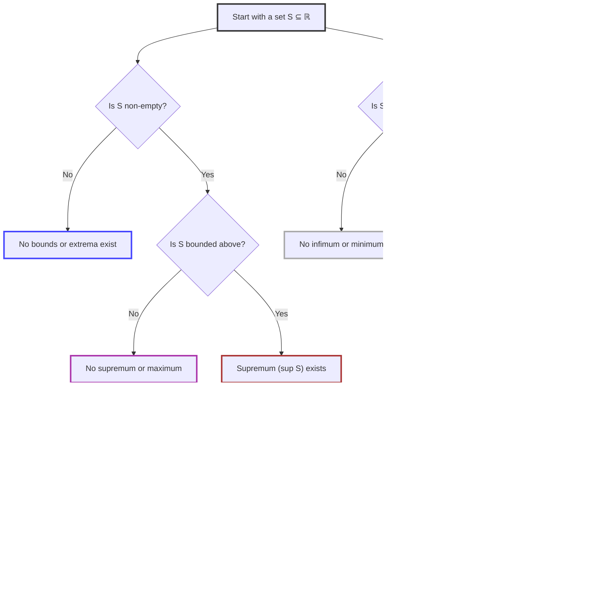

# **Beyond Limits: Exploring Bounds and Extremal Values in Real Analysis** 📚✨

In the vast continuum of real numbers, understanding the notions of bounds and extremal values is essential. These concepts not only help us grasp the structure of mathematical sets but also underpin many fundamental theorems in analysis.

---

## **Upper Bounds and Maxima** 📏🔝

Consider a subset $S \subseteq \mathbb{R}$. An **upper bound** of $S$ is a real number $b$ such that every element $x$ in $S$ satisfies $x \leq b$. If $b$ is an element of $S$ itself, it's called the **maximum** of $S$, denoted as:

$$
\max S = b
$$

However, not all sets have a maximum. For instance, the open interval $(0,1)$ has no maximum since it doesn't include the endpoint 1, even though 1 is an upper bound.

---

## **Supremum: The Least Upper Bound** 📐🔺

When a set lacks a maximum, we turn to the concept of the **supremum** or _least upper bound_. The supremum of a set $S$, denoted $\sup S$, is the smallest real number that is greater than or equal to every element in $S$. Formally:

* $\sup S$ is an upper bound of $S$.
* For any upper bound $b$ of $S$, $\sup S \leq b$.

If $\sup S$ belongs to $S$, it coincides with $\max S$.

---

## **The Completeness Axiom: Bridging Gaps** 🧱🔗

A cornerstone of real analysis is the **Completeness Axiom**, which asserts:

> Every non-empty subset of $\mathbb{R}$ that is bounded above has a least upper bound in $\mathbb{R}$.

This property distinguishes the real numbers from the rationals. For example, the set $\{ x \in \mathbb{Q} \mid x^2 < 2 \}$ is bounded above in $\mathbb{Q}$ but lacks a least upper bound within $\mathbb{Q}$, as $\sqrt{2}$ is irrational.

---

## **Lower Bounds and Minima** 📉🔽

Dually, a **lower bound** of a set $S \subseteq \mathbb{R}$ is a real number $L$ such that $x \geq L$ for all $x \in S$. If $L$ is in $S$, it's the **minimum**:

$$
\min S = L
$$

When a set doesn't have a minimum, we consider the **infimum** or greatest lower bound, $\inf S$, defined analogously to the supremum.

---

## **Properties of Supremum and Infimum** 🔍📊

Understanding how suprema and infima behave under various operations is crucial:

* **Additivity**: For non-empty subsets $A, B \subseteq \mathbb{R}$, define $C = \{ a + b \mid a \in A, b \in B \}$. Then:

$$
\sup C = \sup A + \sup B \quad \text{and} \quad \inf C = \inf A + \inf B
$$

* **Sandwich Theorem**: If every element of set $A$ is less than or equal to every element of set $B$, then:

$$
\sup A \leq \inf B
$$

These properties are instrumental in analyzing the behavior of functions and sequences.

---

## **The Well-Ordering Principle** 🔢📘

The **Well-Ordering Principle** states:

> Every non-empty subset of the positive integers $\mathbb{Z}^+$ has a least element.

This principle is fundamental in proofs involving induction and plays a vital role in number theory and discrete mathematics.

---

## **Conclusion: The Power of Bounds** 🧠💡

Bounds and extremal values are more than just theoretical constructs; they are the tools that allow us to navigate the infinite landscape of real numbers. By understanding these concepts, we gain the ability to define limits, ensure convergence, and establish the continuity and integrity of mathematical structures.



```mermaid
flowchart TD
    Start[Start with a set S ⊆ ℝ]
    
    Start --> CheckEmpty{"Is S non-empty?"}
    CheckEmpty -- No --> EndEmpty["No bounds or extrema exist"]
    CheckEmpty -- Yes --> BoundedAbove{"Is S bounded above?"}
    
    BoundedAbove -- No --> NoSup["No supremum or maximum"]
    BoundedAbove -- Yes --> SupExists["Supremum (sup S) exists"]
    
    SupExists --> MaxCheck{"Is sup S ∈ S?"}
    MaxCheck -- Yes --> MaxExists["Maximum (max S) = sup S"]
    MaxCheck -- No --> NoMax["No maximum exists"]
    
    Start --> BoundedBelow{"Is S bounded below?"}
    BoundedBelow -- No --> NoInf["No infimum or minimum"]
    BoundedBelow -- Yes --> InfExists["Infimum (inf S) exists"]
    
    InfExists --> MinCheck{"Is inf S ∈ S?"}
    MinCheck -- Yes --> MinExists["Minimum (min S) = inf S"]
    MinCheck -- No --> NoMin["No minimum exists"]
    
    style Start stroke:#333,stroke-width:3px
    style SupExists stroke:#A33,stroke-width:3px
    style InfExists stroke:#3A3,stroke-width:3px
    style MaxExists stroke:#33A,stroke-width:3px
    style MinExists stroke:#AA3,stroke-width:3px
    style NoSup stroke:#A3A,stroke-width:3px
    style NoInf stroke:#AAA,stroke-width:3px
    style NoMax stroke:#F44,stroke-width:3px
    style NoMin stroke:#4F4,stroke-width:3px
    style EndEmpty stroke:#44F,stroke-width:3px
```


---

## Structural Properties of Bounds 🌱🧠🧩

### Additivity of Supremum and Infimum ➕🟰🧮

Let $( A, B \subseteq \mathbb{R} )$ be non-empty. Define:

```math
  C = \{ a + b \mid a \in A, b \in B \}  
```


Then:

```math
  \sup C = \sup A + \sup B \quad \text{and} \quad \inf C = \inf A + \inf B  
```

 📏📊🧷

This additive property illustrates how bounds behave under Minkowski-type set addition.

```
0️⃣1️⃣2️⃣3️⃣4️⃣5️⃣6️⃣7️⃣8️⃣9️⃣🔟⏩️⏩️⏩️
⬜️⬜️🟠🟧🟧🟧🟠⬜️⬜️
𝐴 ─┾━━━━━━━┽─
0️⃣1️⃣2️⃣3️⃣4️⃣5️⃣6️⃣7️⃣8️⃣9️⃣🔟⏩️⏩️⏩️
⬜️⬜️⬜️🟣🟪🟣⬜️⬜️
𝐵 ───┾━━━┽─
 +    ➘    ➘
0️⃣1️⃣2️⃣3️⃣4️⃣5️⃣6️⃣7️⃣8️⃣9️⃣🔟⏩️⏩️⏩️
⬜️⬜️⬜️⬜️⬜️🔴🟥🟥🟥🟥🟥🔴⬜️⬜️
𝐶 ──────┾━━━━━━━━━━┽─
```

### Sandwich Theorem for Bounds 📜📏🔎

Let $( A, B \subseteq \mathbb{R} )$, non-empty, such that:

```math
  \forall a \in A, \forall b \in B, \ a \leq b 
 
```
 

Then:

```math
  \sup A \leq \inf B 
```

This is fundamental for establishing interval convergence and bounding sequences. It guarantees a non-empty interval between $( A )$ and $( B )$.

```
𝐸 ─┾━━━━━━┽──────
𝐹 ────────┾━━━━━━━┽─
◻️◻️🟣🟪🟪🟣🔵🟦🟦🟦🔵⬜️⬜️
```


