> Nature's great book is written in mathematical symbols.       
> - ❦ Galileo Galilei

Throughout history, humans (and indeed animals and even plants) have encountered countless problems and averse situations. To address these, we naturally began performing certain operations or actions that proved effective again and again. Over time, humans took these useful patterns and organized them into systematic frameworks, discovering similarities between seemingly different scenarios.

We arrived at the notion of numbers. Abstract tools that capture relationships such as counting quantities, measuring distances, and tracking seasons. Over time, we identified recurring patterns in these activities and formalized them, calling the results “numbers”. As the variety of applications grew, so did our understanding, culminating in systems like the natural numbers, integers, rationals, and reals. With each step, numbers evolved beyond mere tallies into a powerful framework that bridges concrete experiences and abstract reasoning. These symbols and rules encapsulate the essential features of our actions—counting, measuring, and manipulating. Numbers are not just theoretical; they are tools forged by the repeated, practical uses in problem-solving.


# 🏵 [Counting](https://github.com/JulTob/Mathematics/wiki/0.3.-%E2%9C%8C%F0%9F%8F%BC-Basic-Arithmetics#counting) 


⚜️ $\color{Gold}Counting$
 is the most basic operation in mathematics, and it all begins with understanding the concept of a successor:. 
Each number has a 
$\color{Gold}\text{next number}$ 
associated. This _next number_ its his 
$\color{Gold}successor$.

⚜️ The **inverse** of the $\color{Gold}successor$, that is the answer to the question _"Which number is_ $n$ _a successor of?"_ is called the $\color{Gold}predecessor$. For example, the predecessor of 5 is 4.

⚜️ We $\color{Silver}represent$ numbers with $\color{LightBlue}symbols$ that refer to bothe the 
$\color{Pink}quantities$ 
and 
$\color{PaleGreen}iterations$
in the succession:

```Ada
0 := ◌
1 := 🔴
2 := 🔴🔴
3 := 🔴🔴🔴
4 := 🔴🔴🔴🔴
5 := 🔴🔴🔴🔴🔴
6 := 🔴🔴🔴🔴🔴🔴
7 := 🔴🔴🔴🔴🔴🔴🔴
8 := 🔴🔴🔴🔴🔴🔴🔴🔴
9 := 🔴🔴🔴🔴🔴🔴🔴🔴🔴
```

⚜️ After the symbol `9` we use the combination of symbols `10` that represents the succeeding quantity, which combines **1** quantity of tens and **0** quantities of units. 

⚜️ This is the essence of positional notation, which underlies our standard number system and the various bases discussed on earlier pages.

```Ada
10 🔴🔴🔴🔴🔴🔴🔴🔴🔴🔴 := 🟡
11 🟡🔴
12 🟡🔴🔴

20 🟡🟡
25 🟡🟡🔴🔴🔴🔴🔴

300 🟢🟢🟢

125 🟢🟡🟡🔴🔴🔴🔴🔴
```


# 🏵 Addition & Substraction

[](https://youtu.be/rV7WjNWHOsI)

## 🔰 Addition 
```math
\color{#7A2}
\text{Addition means combining two quantities.}
```

⚜️ $\color{Gold}Addition$ is combining two quantities. To 
$\color{Gold}Add$
means to make a set of elements (say, apples) with the element of two different sets.  
Just like putting apples from two bags altogether in another bag, we can count the resulting apples to see that they are added together following the arithmetic rules of addition.

> Add: Join, Advance, Aggregate.  
> Addend: Any of the two numbers to be added.
> Sum: The result of the addition.

```mermaid
---
config:
  look: handDrawn
  theme: dark
---
graph TD

style id3 fill:#300,stroke:#A00,stroke-width:2px
style id3n fill:#300,color:#f00,stroke:#900,stroke-width:2px

style id2 fill:#030,stroke:#0A0,stroke-width:2px
style id2n fill:#030,color:#0f0,stroke:#090,stroke-width:2px

style idplus fill:#555,stroke:#999,color:#fff,stroke-width:5px
style ideq fill:#555,stroke:#999,color:#fff,stroke-width:5px

style id5n fill:#330,stroke:#550,color:#ff0,stroke-width:2px
style id5 fill:#330,stroke:#550,stroke-width:2px

  id3(🍎🍎🍎)
  id3n(((3)))
  id2(🍏🍏)
  id2n(((2)))
  idplus((＋))
  id5(🍎🍎🍎🍏🍏)
  id5n(((5)))
  ideq((=))


  id3 <--> id3n
  id2 <--> id2n
  id3n --> idplus
  id2n --> idplus 
  idplus ==> ideq
  ideq ==> id5n
  id5n <--> id5
```




Addition models a certain behavior of things. If you have two boxes filled with the same kind of object, and you pour them into a bigger box, the amount of stuff doesn’t disappear or grow, it just adds up.

### ♦️ Associative property

The way you group numbers doesn't change the sum.

```math
\color{Pink}
𝑎﹢𝑏﹢𝑐 ＝ 𝑎﹢（𝑏﹢𝑐）＝（𝑎﹢𝑏）﹢𝑐 
```





```mermaid
---
config:
  look: handDrawn
  theme: dark
---
block-beta
  columns 3
  a   b   c
  a+b:2    𝑐
  𝑎   b+c:2 
  a+b+c:3
```

```mermaid
---
config:
  look: handDrawn
  theme: dark
---
graph LR

I(ℝ₀)
A(ℝ₁)
B(ℝ₂)
C(ℝ₃)
AB(ℝ₄)
BC(ℝ₅)
AC(ℝ₆)
ABC(ℝ₇)

I --->|+a| A 
I --->|+b| B
I --->|+c| C
A --->|+b| AB
A --->|+c| AC
B --->|+a| AB 
C --->|+b| BC
B --->|+c| BC
C --->|+a| AC
AC --->|+b| ABC
AB --->|+c| ABC
BC --->|+a| ABC 
```

### ♦️ Commutative property
The order in which numbers are added does not change the sum.
```math 
\color{Pink}
𝑎﹢𝑏＝𝑏﹢𝑎 
```
```math 
\color{silver}
🍏🍏 ﹢ 🍎🍎🍎 ＝ 🍎🍎🍎 ﹢ 🍏🍏 
```

```mermaid
---
config:
  look: handDrawn
  theme: dark
---
graph LR

A(ℝ₀)
B(ℝ₁)
C(ℝ₃)
D(ℝ₂)

A --->|+a| B 
B --->|+b| C
A --->|a+b| C
A --->|+b| D
D --->|+a| C 


```

⚜️ These two properties are phrased as: ___The order of summation does not affect the result___

⚜️ These properties are why **adding** numbers is so flexible!


### ♦️ Neutral Element
Have you ever had a group project where one partner does absolutely nothing? Well, there exist one number that, when adding, does absolutely nothing too!    
This  lazy number is the **zero**: '0'

When in addition, zero is called the $\color{gold}\text{Neutral Element}$. For he is absolutely neutral, and therefor doesn't change the outcome.
```math
a + 0 = a
```




```mermaid
---
config:
  look: handDrawn
  theme: dark
---
graph LR

I(ℝ₀)

I --->|+0| I
```

## 🔰 Subtraction
⚜️ To 
$\color{Gold}subtract$
 is to reverse the operation of the addition of a number. 
It can also be interpreted as the addition of an 
$\color{Gold}inverse$
 of a number.

> Subtracting $5$ is like adding $-5$.


### ♦️ Additive Inverse
⚜️ An Inverse of a number is the number that, when combined together with the original number, they 
$\color{Silver}Add$ 
 to zero.
```Ada
8 + -8 = 0
8 + 8̚ = 0

𝑎 + −𝑎 = 0
𝑎 + 𝑎̚ = 0
```

```math
\color{Pink}
\begin{matrix}
￢a = 1̚·a = a̚ & &  ￢￢a=a       & &   a̚·b=a·b̚ = ￢ab \\
a̚·b̚=ab    & &  ￢(a+b)= a̚+b̚  & &  ￢(a-b) = b-a \\
\end{matrix}
```

# 🏵 Negative Numbers

[](https://youtu.be/3-5DKCLJspM)

⚜️ Negative numbers are values less than zero, representing the additive inverse of positive numbers. They measure a distance from zero but in the opposite direction. 

```math
\color{Silver}
a + a̚ = 0
```
⚜️ The negation symbol $(\text{\color{red}¬})$ indicates a negative value. It differs from subtraction, as negation creates a new entity (a negative number) not an operation between two positive elements. In practical terms, think of subtraction as debt.

⚜️ Historically, mathematicians were skeptical of negative numbers, considering them fictitious. Today, they are recognized as essential and opposite counterparts to positive numbers.

⚜️ For example, a friend is opening a business: a Drinks Factory! He makes Soda, Pop, and Coke. My friend spends €1 per soda, but wants to sell for €0.50:
```math
\text{\color{gold}profit} = \text{\color{green}Selling Price} - \text{\color{red}Cost Price}
```
⚜️ So we see our profit is $\color{red}￢0.50€$. Our friend is looking at us weird: "Where am I going to get the '-50' cents coins from?". "Look at it this way." we would explain, " $\color{green}Sells$ are like going up, and $\color{red}Costs$ are like going down. Profit is just the point where you end. If you are below were you started, you generate a new type of number: Debt. Debt and profit are opposites, so they can be put together, but in opposite directions. That sign only tells us the direction of the money: it is going out of your pocket, not into it."


# 🏵 Multiplication 


⚜️ We call the reiterated addition of a quantity 
$\color{Gold}multiplication$.

⚜️ $\color{Gold}Multiplication$. is essentially **repeated addition**. Instead of adding the same number over and over again, we multiply. For example, $\color{silver}3×4$ means adding $3$ four times:  $\color{silver}3 + 3 + 3 + 3 = 3·4 = 12$.


```math
\color{Aqua}
\begin{matrix}
  & 1 & 2 & 3 & 4 & 5 & 6 & 7 & 8 & 9 & 10\\
⨯  & - & - & - & - & - & - & - & - & - & - \\
1 & 1 & 2 & 3 & 4 & 5 & 6 & 7 & 8 & 9 & 10\\
2 & 2 & 4 & 6 & 8 & 10 & 12 & 14 & 16 & 18 & 20\\
3 & 3 & 6 & 9 & 12 & 15 & 18 & 21 & 24 & 27 & 30\\
4 & 4 & 8 & 12 & 16 & 20 & 24 & 28 & 32 & 36 & 40\\
5 & 5 & 10 & 15 & 20 & 25 & 30 & 35 & 40 & 45 & 50\\
6 & 6 & 12 & 18 & 24 & 30 & 36 & 42 & 48 & 54 & 60\\
7 & 7 & 14 & 21 & 28 & 35 & 42 & 49 & 56 & 63 & 70\\
8 & 8 & 16 & 24 & 32 & 40 & 48 & 56 & 64 & 72 & 80\\
9 & 9 & 18 & 27 & 36 & 45 & 54 & 63 & 72 & 81 & 90\\
10 & 10 & 20 & 30 & 40 & 50 & 60 & 70 & 80 & 90 & 100\\
\end{matrix}

```


⚜️ But multiplication is also something more. Multiplication introduces a scaling factor, or a conversion rate, a price.
```math
\color{#888}
a×b=c
```
⚜️ Here, $a$ represents the original amount, $b$ is the scaling factor, and $c$ is the new, scaled amount.

```mermaid
---
config:
  look: handDrawn
  theme: dark

---
graph TD
    subgraph Price
        A@{ shape: hex, label: "🪙🪙🪙<br>🪙🪙🪙<br>🪙🪙🪙"}
        style Price fill:blue,stroke:Cyan,stroke-width:2px
        A
    end
    subgraph Candy
        style Candy fill:darkred,stroke:tomato,stroke-width:2px
        F@{ shape: rect, label: "🍬<br>🍬<br>🍬<br>" }
    end
    Candy -->|⨯ 3coins per candy| Price

    linkStyle 0 stroke:aqua,stroke-width:2px,color:Aquamarinem

```


⚜️ Think of this as a cost. You have $\color{tomato}a$ apples, and they cost $b \text{gold pieces}$. Then $c$ is the total amount of gold you can get if you sell them all.


### ♦️ Associative property

⚜️ Basically, we observe that the order we apply the multiplication of numbers is not relevant, as any combination of multiplications will equal the same quantity in any order we apply these transformations.

⚜️ Just like with addition, the grouping of numbers in multiplication doesn’t affect the product.

```math
\color{Pink}
𝑎⨯𝑏⨯𝑐 　＝ 　𝑎⨯（𝑏⨯𝑐）＝（𝑎⨯𝑏）⨯𝑐 
```

### ♦️ Commutative Property

```math
\color{Pink}
ab = ba
```
⚜️ ___The order of the factors does not affect the product___

### ♦️ Distributive Property
The distributive property and factorization are closely
related - they're the same equation,
```math
\color{Pink}
a(b+ c) = ab+ ac
```
and
```math
\color{Pink}
ab + ac = a(b+ c)
```
just seen from different perspectives.

# 🏵 Division

[](https://youtu.be/fr04p6Ar9ic)


⚜️ $\color{Gold}Division$ is the inverse of multiplication. Dividing is like asking how many times one number fits into another.


⚜️  In division, we are breaking a number into equal parts. For example, dividing 10 by 2 means splitting 10 into 2 equal groups, resulting in 5 in each group.

```math
\color{Tomato}
a:b = c ⟺ a = b·c
```


⚜️ Division by $a$ corresponds to the __fraction__ of the unity into equal __divisions__. When we break the unity in this way we obtain $a$ pieces of the size $\ddot{a}$.
```math
\color{Tomato}
\frac{1}{a} = \ddot{a} ⟺ a·\ddot{a} = 1

```


### 🔰 Fractions 
[](https://youtu.be/qyW2mWvvtZ8)

⚜️  $\color{Gold}Fraction$ are a way to represent parts of a whole. A fraction shows **how many parts** we have and **how many equal parts** the whole is divided into.

⚜️ We represent them with the number of pieces (numerator) over a line with the number of divisions on the bottom (divisor).
- The **numerator** (top number) tells us how many parts we have.
- The **denominator** (bottom number) tells us how many equal parts make up a whole.


```math 
\color{Pink}
\frac{numerator}{divisor}
```


#### ♦️ Fractions' Arithmetics 
- **Addition**:
  ```math
  \color{Pink}
  \frac{a}{b} + \frac{c}{d} = \frac{ad+cb}{bd}
  ```
- **Multiplication**:
```math
\color{Pink}
\frac{a}{b} * \frac{c}{d} = \frac{ac}{bd}
```
- **Inversion**:
```math
\color{Pink}
1 : \frac{a}{b} = \frac{b}{a}
```
- **Simplification**:
```math
\color{Pink}
 \frac{ca}{cb} = \frac{a}{b}
```


# 🏵 **Decimal Notation**


[](https://youtu.be/jC4SWFag6Qw)

⚜️ The use of decimal notation is used to represent smaller quantities than the unit. 

⚜️ We separate the smaller quantities with a decimal dot separator `.` , and continue the pattern for decimal notation. Meaning that for each position to the right we are using quantities ten times smaller.

⚜️ In some countries they use the comma symbol `,`  and in some countries they position the comma on top as a lonesome tilde `'`

- **0.5** is the same as $\ddot{2}$
- **0.25** is the same as $\ddot{4}$


# 🏵 Percentages


[](https://youtu.be/n9fgcm0Pwgs)


⚜️ Percentages are fractions with _A Hundred_ for divisor, as it is a very convenient quantity for mental math and insight into data.

⚜️ Percentages are widely used in commerce, economy, planning, statistics, discounts, interest rates...

```math
\frac{a}{100} = a\%
```


[](https://youtu.be/-Xt4UDk7Kzw)


# 🏵 Large & Small Numbers

[](https://youtu.be/AkWtUOwlUgs)

⚜️ We call _large numbers_ to those that are not represented by a single symbol, but by a combination of the digit symbols.

⚜️ We use the positional notation to represent quantities that grow by a factor from the base.  


# 🏵 Addition & Subtraction of Large Numbers

[](https://youtu.be/YFyOsvnr9ig)

⚜️ For the addition of large numbers we add the units with the units, the tens with the tens, the hundreds with the hundreds...

⚜️ That is: Every size level, also called Exponential position, adds together.

⚜️ When one factor exceeds the base we instead add a unit to the next bigger level, and subtract the base from it. This is called the ___Carry On___.


```math
\color{Pink}
\begin{matrix}
  & 2   & 5  & 0 \\
+ & 1   & 5  & 0 \\
- & -   & -  & - \\
  & 3   & 10 & 0 \\
- & -   & -  & - \\  
  & 3+1 & {\color{Red}\cancel{1}}0 & 0 \\
- & -   & -  & - \\    
  & 4   &  0 & 0 \\
\end{matrix}
```

⚜️ It can also be interpreted as taking the string of digits and moving that excessive digit onto the next level to be added.

⚜️ Subtraction works under the same rules, but with inverses. In this case a bigger level can be broken down so the small level has a base number of extra units to subtract from

```math
\color{Pink}
\begin{matrix}
  & 2 & 5 & 0 \\
- & 1 & 6 & 0 \\
- & - & - & - \\
  & 1 & {\color{Tomato}15} & 0 \\
- & 1 &  6 & 0 \\
- & - & - & - \\
  & 0 & 9 & 0 \\
\end{matrix}
```

# 🏵 Distributive Property

[](https://youtu.be/LC_R2Zh66fU)

⚜️ The use and practicality of multiplication is based on this property, the $\color{Gold}distributive$ __property__: 

```math
\color{Pink}
a·(b+c) = a·b + a·c
```


# 🏵 Multiplication Of Large Numbers


⚜️ A quantity can be deconstructed in its parts, to which we then apply the _transformation_ of the __multiplication__, and then reconstruct together.


```math
24 x 52 = 
\begin{matrix}
   && 50 & 2  \\
⨯  &&  - & -   \\
20 &|& 1 000 & 40 \\
4  &|& 200 & 8    \\
& = & = & = \\
&&& 1248

\end{matrix}
```


[](https://youtu.be/s1Ly3cX4yHc)


# 🏵 Long Division


[](https://youtu.be/rI2peJT2Ty8)
> [!NOTE]
> - The **dividend** (number to be divided) is on the left.  
> - The **divisor** is on the right.  
> - The **quotient** goes *under* the divisor.

> [!IMPORTANT]
> - Start from the left-most digits of the dividend and see how many times the divisor fits.
> - Write that count in the quotient row underneath the divisor.
> - Multiply & subtract to find a partial remainder.
> - Bring down the next digit; repeat until no digits remain.
> - If any leftover remains at the end, that is the remainder.


```math
\frac{784}{8} = 
\color{silver}
\begin{array}{ccc|c}
 7  & 8 & 4  & 8 \\
    &   &    & ── \\
 \color{red}{7}  &  \color{red}{2} &  \color{red}{0} &  \color{red}{90} \\
 0  & 6 & 4 &    \\
    & \color{orange}{6}  & \color{orange}{4}  & \color{orange}{8} \\
    &   & \color{lime}{0}   & \\
\end{array} = {\color{red}9}{\color{orange}8} + \frac{\color{lime}{0}}{8}
```


# 🏵 Order Of Operators

[](https://youtu.be/y_f7c3ztFrI)

⚜️ In order of importance:
1. Parenthesis 
2. Exponents
3. Multiplication and Division
4. Addition & Subtraction


This hierarchical order ensures consistency and precision in calculations.


# 🏵 Absolute Value

[](https://youtu.be/Wirk4o3FHPA)

⚜️ The absolute value represents the distance of a number from zero on the number line and is always positive or zero.

```math
∣a∣≥0
```


***

# Code

You can try coding your own mathematical programs with these [code samples](https://www.tutorialspoint.com/compile_ada_online.php) .


----
By mastering these fundamental operations—from counting and addition to the complexities of long division—you build upon the precise language of logic and standard notation introduced in previous pages. This structured approach turns abstract numerical ideas into a robust, interconnected system that underpins all of mathematics.
