> $\color{white}\text{“The utmost abstractions }$ 
> $\color{white}\text{ are the true weapons}$ 
> $\color{white}\text{ with which to control}$ 
> $\color{white}\text{ our thought}$ 
> $\color{white}\text{ of concrete fact.”}$  
> - $\color{white}\text{Alfred North Whitehead}$

📕 Math is $\color{gray}\text{The art of turning the universe into a solvable puzzle.}$ Many of our math problems, such as life, tend to break down into two steps:
1. ###  ✒️ Modeling: 
  - Simplify and capture reality within a clear, abstract framework. 
2. ### 📐 Computation:
  - Develop algorithms and methods to find solutions within that framework.

# 1️⃣ Modelling

📗 Modeling is the process of taking chaotic real-world situations and distilling them into precise mathematical representations. This step involves two major actions:
- 📝 Express the situation 
  - Use formulas and symbols to capture the essence of the problem.  

- 🫀=♥️ Represent with analogous Systems.
  - 🩻 The new system is valid if it mirrors some key relationships, mapping the original scenario onto a simplified model.

📒 Example: The Zookeeper Problem 

🧩 Modeling

Imagine a zookeeper who needs to separate animals into enclosures so that no predator is placed with its prey. To “encode” which species can’t coexist, we can model the situation as a graph coloring problem.

SOLUTION:
 
- Modeling Insight:
  - Represent each species as a node.
  - Draw a red edge between two nodes if the corresponding species should not be together.

By modeling it as a graph, we simplify real-life complexities into edges/nodes, then search for colorings to separate them.

```mermaid
---
config:
  look: handDrawn
  theme: dark
  
---
flowchart TD
    L@{ shape: dbl-circ, label: "🐆" }
    Z@{ shape: dbl-circ, label: "🦓" }
    C@{ shape: dbl-circ, label: "🐊" }
    P@{ shape: dbl-circ, label: "🐘" }
    G@{ shape: dbl-circ, label: "🐅" }
    T@{ shape: dbl-circ, label: "🐢" }
    C ==x T
    L ==x T
    C ==x L
    G ==x P
    L ==x Z 
    C ==x Z


    G ==x Z
    linkStyle 0,1,2,3,4,5,6 stroke: tomato

    classDef E1 fill:#500,stroke:#A00,stroke-width:2px;
    class L,G E1
    classDef E2 fill:#050,stroke:#0A0,stroke-width:2px;
    class Z,T,P E2
    classDef E3 fill:#005,stroke:#00A,stroke-width:2px;
    class C E3
```

# 
2️⃣ Computation 

🗝️ Once we have a model (of relations, or equations, or a graph, or a set of conditions...), we try finding the solving algorithm(s).

🔑 Algorithms are the sequence of instructions to execute to find the solution.

🔗 Algorithms are considered better when they have speed (less steps) ⚡ and precision (a more accurate answer) 🔍. 

🧷  Just as "finding your keys in the morning" can be subdivided into rooms, draws, and pockets, algorithms can be divided into smaller algorithms. And just as finding your keys, finding the answer to the problem can be just as tedious and frustrating 🧠🔑

## 📘 How do we make these steps happen?

🥋 Mathematicians don't just stumble onto the solution. There’s a method to this madness. Below are some of the tools from our mathematical repertoire:

- ## 🟥 Identify Elements (Variables)
  🤔 This is where we ask, “Who are the players in this game?” 

  - ### 🔴 Givens ${\color{Red} (Constants)}$
    📎 These are the elements that don't change during the game. Sometimes it's trivial, but at some instances it can be crucial to understand where are our foundations. 

  - ### 🔴 Choices ${\color{Red} (Parameters)}$
    📍 These are the things we have control over: the knobs we can turn. 

  - ### 🔴 Changes ${\color{Red} (Variables)}$
    📐 These are what fluctuate. Modifications that can happen during the game.

  - ### 🔴 Chance  ${\color{Red} (Random Variables)}$
    🎲 The unpredictable. Elements representing uncertainty, like dice rolls or stock prices.

- ## 🟪 Abstract the Elements

  📌 This is where we take complex real-world objects and simplify them until they only keep what we need. "Mathematical minimalism”, where you are left with only what is necessary:

  - ###  🟣 Use **simple** notation

    🖊️ This is very personal, but most mathematicians consider _simple_ to use individual symbols, as writing out everything in full sentences is just too much work (and they love Greek letters!).

  - ### 🟣 Turn ideas into algebra ${\color{Purple} (Relationships)}$

    🔍 Bring into focus how one element relates to another, or simply not at all, and how new elements can be set from these relationships.

  - ### 🟣 Make a Diagram 

    🖌️ Pictures can speak louder than symbols.

  - ### 🟣 Make a table
    📅 Take data of specific cases and order it.

- ## 🟦 Formulate a Model
  📇 We should craft the mathematical world we want to live in.

  - ### 🔵 Express Terms and Equations
    - #### 🔷 Terms
      🗄️ These are the composed objects that emerge from the combinations of the elements, even if the term is just one single element.
    - #### 🔷 Equations
      📒 When some terms are comparable to some other term, the way we can express this fact is with a comparison.    
      📒 We call these comparison between elements ${\color{Blue}Equations}$ when the comparison is clear, or ${\color{Blue}Inequations}$ when it's just bounded somehow. To be honest, most people call them _inequalities_, but I like "Inequations" better!

  - ### 🔵 Use Graphs and Plots
    📰 The use of visual aid is a must in many problems. Clarity and insight can come from representing terms in a certain way. A testament on the value of the arts for mathematics.

  - ### 🔵 Identify the type of equations 
    🔎 The way terms relate can be of some already known type. The ways we can solve the problem may be written somewhere out there, and there is no shame on getting help for it.
    > $\color{#A00}\text{If I have seen further than others,}$ 
    > $\color{#A00}\text{it is because I have stood }$
    > $\color{#A00}\text{on the shoulders of giants.}$ 
    > - 📚 $\color{#A00}\text{Isaac Newton}$

- ## 🟩 Spot the **knowns** and **unknowns**
  - 🟢 Like a detective, list the facts you have and what you need to uncover. 🕵️ Finding out what pieces we have: the knowns; and what we’re still looking for: the unknowns. We may clarify, like a detective does, information about what is yet to be determined.

- ## 🟨 Recognize the familiar 
  - 🟡 Does this looks like that problem you solved already? 
  - 🟡 What area of mathematics deals with problems like this one?
  - 🟡 What are you certain you can solve? 
  - 🟡 What is out of your comfort zone? 
  

- ## 🟧 Try special cases
  - 🟠 Sometimes you have to play with toy versions of the problem to get insights. It's practicing guitar scales before shredding a solo 🎸.  
  - 🟠 Try different values for the variables, look for other models that may be similar somehow, determine a simpler version of the algorithm.

- ## 🟥 Find patterns
  - 🔴 Find Insight
    🖇️ Try to connect the dots, maybe something will reveal itself that you didn’t expect. 
    > $\color{#0A0}\text{Eureka!}$ 
    >> $\color{#0A0}Archimedes$ (in the bathtub 🛁).

- ## 🟫 Compare to analog problems
  - 🟤 Mathematicians love analogies. Compare complex problems to simpler ones.   
  - 🟤 Does the problem become simpler when you take away one element? What if you add one?

- ## 🟪 Insert something new
  🟣 Here’s where creativity comes in: what happens if you tweak something unexpected? Maybe add a new term to the equation? 🤯  
  🟣 This is where mathematicians get to be artists 🎨.

- ## 🟦 Take cases
  🔵 Break the problem into smaller, manageable chunks. If you can’t solve the whole puzzle, maybe you can solve one piece at a time 🧩.

- ## 🟩 Work backwards 
  - 🟢 Try to Reverse Engineer the problem.
  - 🟢 Pretend you’ve already solved the problem and work your way back. This can be surprisingly effective (and is basically how detectives work in movies 🕶️).
  - 🟢 Do you know ONE solution to the problem? Try reasoning why that's a solution.

- ## 🟨 Intermediary goals
  - 🟡 Set checkpoints 🏁, because no one climbs a mountain 🏔️ all at once. Break the problem into smaller milestones.

- ## 🟧 Indirect reasoning
  Think outside the box 📦, or even better, think as if there is no box 🥄🕶️.

- ## 🟥 Induction
  - 🔴 Look at specific cases and ask, “What happens if we do this in general?” Try figuring out the rules of the universe from one drop of water 💧.

- ## 🟫 Confirm Answers 
  The moment of truth:
  - ### 🟤 **Check** your solution 
  - ### 🟤 Verify
    - 🤎 Mathematical Correctness ${\color{Orange} (Valid)}$
    - 🤎 Logical Correctness ${\color{Orange} (Soundness)}$
    - Verify it holds mathematically and logically. (Because nothing’s worse than an elegant answer that’s utterly wrong 🚫).

📘 We use a combination of these and more methods for different mathematical problems to arrive at satisfactory answers. Different problems may require different approaches, and skilled mathematicians use a toolkit of methods to tackle a wide range of challenges. 

📙 At the end of the day, mathematicians mix and match these techniques like chefs in a kitchen 🍳—different problems, different methods, but always with the goal of cooking up something satisfying.

